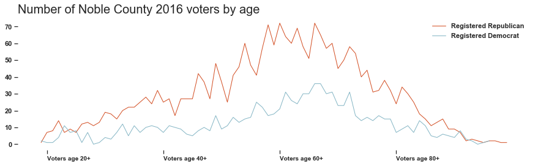

# PFA Skills Test

Before importing, had to fix some data issues (missing comma for "Female Rank 2")

Packages used:


```python
import pandas as pd
import matplotlib.pyplot as plt
import seaborn as sns
```

My first step was to clean up the popular names table, as it has eleven columns. Not only annoying, but both rank and gender could be useful data as seperate columns. So, I created some new ones and cleaned up the data a bit.


```python
names = pd.read_csv("ssa_baby_names.txt") 
names = names.melt(id_vars=["Year"],  var_name="Rank") #pivoted the table 
names[['Gender','RankWord','Rank']] = names.Rank.str.split(expand=True) #split the column into three columns
names = names.drop('RankWord', axis=1).sort_values(by=['Year','Rank'], ascending=False) #dropped a column
names.rename(columns={'value':'FIRST_NAME'}, inplace=True) #column name fix
names.FIRST_NAME = names.FIRST_NAME.str.upper() #updated to match next table's data 
names['Year']=names['Year'].astype(str)  #we don't want to aggregate year, so we'll turn it to a string
```

## Names table is good to go

#### **Question 1:**
_How many active voters in Noble County have a first name that has ever appeared among the most popular names?_

There are **2037** active voters in Noble County whose first name has appeared among the most popular names.

I created a filter of all the first names from the names table:


```python
thefilter = names.FIRST_NAME #list of all most popular names
```

followed by uploading and cleaning up the table of voters in Noble County:


```python
noble = pd.read_csv("NOBLE.txt") #data from https://www6.sos.state.oh.us/ords/f?p=111:1
noble['popname'] = noble.FIRST_NAME.isin(thefilter) #adds boolean for if name is in the popular name list
noble['Year'] = noble['DATE_OF_BIRTH'].str[:4] #adds new column for year of birth 
noble = noble[noble.VOTER_STATUS=='ACTIVE'] #only show rows where VOTER_STATUS is active
```

and then counting the number of "true":


```python
noble.popname.value_counts()
```


    False    5155
    True     2037
    Name: popname, dtype: int64


### **Question 2:** 
_How many active voters in Noble County have a first name that was among the most popular names in the year they were born?_

#### There are **1098** active voters in Noble County whose first name was popular the year they were born.


By doing an inner join between the names and noble table, we'll only see rows in which both the FIRST_NAME and Year match.


```python
merge = noble.merge(names, on=['FIRST_NAME','Year'], how='inner')
```

followed by a a count of the FIRST_NAME in the new table:


```python
merge.FIRST_NAME.count()
```


    1098


### **Question 3**
_How many households in Noble County with at least one registered voter also contain at least one voter with a first name among the most popular in the year they were born?_

There are **1017** households with at least one voter whose name was popular the year they were born.

Since we now have a table with all the active voters with popular names the year they were born, we just need to count the number of unique addresses. 

***But!***

It's possible that there's more than one household per address - either because there are apartments, or because the same street name may exist multiple times in a single county. Therefore, rather than just counting the number of unique addresses, we actually want to count the number of unique combinations of address, secondary address (for apartments), and zipcode (for different streets with the same name). 


```python
merge['RESIDENTIAL_SECONDARY_ADDR']=merge.RESIDENTIAL_SECONDARY_ADDR.fillna('NA') #filling in blank secondary addresses for grouping
merge.groupby(['RESIDENTIAL_ADDRESS1','RESIDENTIAL_SECONDARY_ADDR','RESIDENTIAL_ZIP']).ngroups
```


    1017


### Question 4: Visualize it


```python
presentableplot = pd.DataFrame(data={'Total': [7192], 'Pop': [2037],'PopYear': [1098]})
sns.set(style="ticks")
f, ax = plt.subplots(figsize=(15, 4))
sns.barplot(x="Total",  data=presentableplot, color="#85B6C5")
sns.barplot(x="Pop",  data=presentableplot, color="#D34E23",)
sns.barplot(x="PopYear",  data=presentableplot, color="#653727",)
ax.set_xticks([1098, 2037, 7192] )
ax.set_xticklabels(['1098 total voters\n with popular names\n the year they were born', '2037 total voters\n with popular names', '7192 voters\n total'], horizontalalignment = 'right', fontsize='10')
ax.xaxis.label.set_visible(False)
ax.yaxis.set_visible(False)
sns.despine(left=True, bottom=True)
```


### And another visualization


```python
dcnt = noble[noble.PARTY_AFFILIATION=='D']
dcnt = dcnt.groupby(['Year']).count().reset_index().sort_values(by='Year', ascending=False)
dcnt['lastelection']=dcnt['GENERAL-11/06/2018'] 
rcnt = noble[noble.PARTY_AFFILIATION=='R']
rcnt = rcnt.groupby(['Year']).count().reset_index().sort_values(by='Year', ascending=False)
rcnt['lastelection']=rcnt['GENERAL-11/06/2018']
```


```python
sns.set(style="ticks")
f, ax = plt.subplots(figsize=(15, 4))
plt.plot( 'Year', 'lastelection', data=rcnt, color='#D34E23', linewidth=1, label="Registered Republican")
plt.plot( 'Year', 'lastelection', data=dcnt, color='#85B6C5', linewidth=1, label='Registered Democrat')
plt.legend()
ax.xaxis.label.set_visible(False)
ax.set_xticks(['1999','1979', '1959', '1939'] )
ax.set_xticklabels(['Voters age 20+','Voters age 40+', 'Voters age 60+', 'Voters age 80+'], horizontalalignment = 'left', fontsize='10')
sns.despine(left=True, bottom=True)
plt.title("Number of Noble County 2016 voters by age", fontsize=20, loc='left')

```


    Text(0.0, 1.0, 'Number of Noble County 2016 voters by age')




