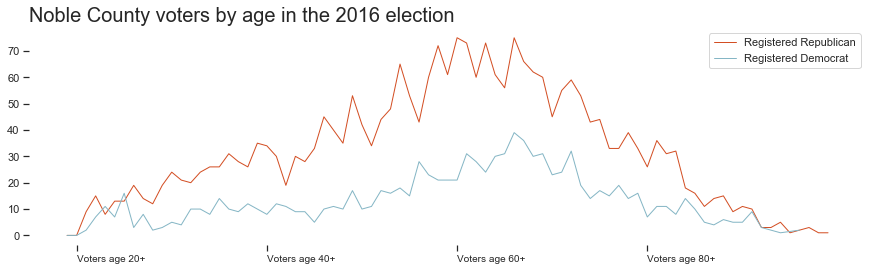

# PFA Skills Test

(Before importing, had to fix the missing comma for "Female Rank 2")

Packages used:


```python
import pandas as pd
import matplotlib.pyplot as plt
import seaborn as sns
```

My first step was to clean up the popular names table, as it has eleven columns. Not only annoying, but both rank and gender could be useful data as seperate columns. So, I created some new ones and cleaned up the data a bit.


```python
names = pd.read_csv("ssa_baby_names.txt") 
names = names.melt(id_vars=["Year"],  var_name="Rank") #pivoted the table 
names[['Gender','RankWord','Rank']] = names.Rank.str.split(expand=True) #split the column into three columns
names = names.drop('RankWord', axis=1).sort_values(by=['Year','Rank'], ascending=False) #dropped a column
names.rename(columns={'value':'FIRST_NAME'}, inplace=True) #column name fix
names.FIRST_NAME = names.FIRST_NAME.str.upper() #updated to match next table's data 
names['Year']=names['Year'].astype(str)  #we don't want to aggregate year, so we'll turn it to a string
```

## Names table is good to go

### **Question 1:**
How many active voters in Noble County have a first name that has ever appeared among the most popular names?

There are **2037** active voters in Noble County whose first name has appeared among the most popular names.


```python
thefilter = names.FIRST_NAME #list of all most popular names
```

followed by uploading and cleaning up the table of voters in Noble County:


```python
noble = pd.read_csv("NOBLE.txt") #data from https://www6.sos.state.oh.us/ords/f?p=111:1
noble['popname'] = noble.FIRST_NAME.isin(thefilter) #adds boolean for if name is in the popular name list
noble['Year'] = noble['DATE_OF_BIRTH'].str[:4] #adds new column for year of birth 
noble = noble[noble.VOTER_STATUS=='ACTIVE'] #only show rows where VOTER_STATUS is active
noble.popname.value_counts() #counting the number of 'true'
```


    False    5155
    True     2037
    Name: popname, dtype: int64


### **Question 2:** 
How many active voters in Noble County have a first name that was among the most popular names in the year they were born?

#### There are **1098** active voters in Noble County whose first name was popular the year they were born.


```python
merge = noble.merge(names, on=['FIRST_NAME','Year'], how='inner')
merge.FIRST_NAME.count()
```


    1098


### **Question 3**
How many households in Noble County with at least one registered voter also contain at least one voter with a first name among the most popular in the year they were born?

There are **1017** households with at least one voter whose name was popular the year they were born.


```python
merge['RESIDENTIAL_SECONDARY_ADDR']=merge.RESIDENTIAL_SECONDARY_ADDR.fillna('NA') #filling in blank secondary addresses for grouping
merge.groupby(['RESIDENTIAL_ADDRESS1','RESIDENTIAL_SECONDARY_ADDR','RESIDENTIAL_ZIP']).ngroups 
#finding every unique combination of address, secondary address (for apartments), and zipcode (for multiples of street names)
```


    1017


### Question 4: Visualize it


```python
presentableplot = pd.DataFrame(data={'Total': [7192], 'Pop': [2037],'PopYear': [1098]})
sns.set(style="ticks")
f, ax = plt.subplots(figsize=(15, 4))
sns.barplot(x="Total",  data=presentableplot, color="#85B6C5")
sns.barplot(x="Pop",  data=presentableplot, color="#D34E23",)
sns.barplot(x="PopYear",  data=presentableplot, color="#653727",)
ax.set_xticks([1098, 2037, 7192] )
ax.set_xticklabels(['1098 total voters\n with popular names\n the year they were born', '2037 total voters\n with popular names', '7192 voters\n total'], horizontalalignment = 'right', fontsize='10')
ax.xaxis.label.set_visible(False)
ax.yaxis.set_visible(False)
sns.despine(left=True, bottom=True)
```


### And another visualization just for fun


```python
dcnt = noble[noble.PARTY_AFFILIATION=='D']
dcnt = dcnt.groupby(['Year']).count().reset_index().sort_values(by='Year', ascending=False)
dcnt['lastelection']=dcnt['GENERAL-11/08/2016'] 
rcnt = noble[noble.PARTY_AFFILIATION=='R']
rcnt = rcnt.groupby(['Year']).count().reset_index().sort_values(by='Year', ascending=False)
rcnt['lastelection']=rcnt['GENERAL-11/08/2016']
```


```python
sns.set(style="ticks")
f, ax = plt.subplots(figsize=(15, 4))
plt.plot( 'Year', 'lastelection', data=rcnt, color='#D34E23', linewidth=1, label="Registered Republican")
plt.plot( 'Year', 'lastelection', data=dcnt, color='#85B6C5', linewidth=1, label='Registered Democrat')
plt.legend()
ax.xaxis.label.set_visible(False)
ax.set_xticks(['1999','1979', '1959', '1939'] )
ax.set_xticklabels(['Voters age 20+','Voters age 40+', 'Voters age 60+', 'Voters age 80+'], horizontalalignment = 'left', fontsize='10')
sns.despine(left=True, bottom=True)
plt.title("Number of Noble County voters by age in the 2016 election", fontsize=20, loc='left')

```


    Text(0.0, 1.0, 'Number of Noble County voters by age in the 2016 election')





```python
noble.head(30)
```


<div>
<style scoped>
    .dataframe tbody tr th:only-of-type {
        vertical-align: middle;
    }

    .dataframe tbody tr th {
        vertical-align: top;
    }

    .dataframe thead th {
        text-align: right;
    }
</style>
<table border="1" class="dataframe">
  <thead>
    <tr style="text-align: right;">
      <th></th>
      <th>SOS_VOTERID</th>
      <th>COUNTY_NUMBER</th>
      <th>COUNTY_ID</th>
      <th>LAST_NAME</th>
      <th>FIRST_NAME</th>
      <th>MIDDLE_NAME</th>
      <th>SUFFIX</th>
      <th>DATE_OF_BIRTH</th>
      <th>REGISTRATION_DATE</th>
      <th>VOTER_STATUS</th>
      <th>PARTY_AFFILIATION</th>
      <th>RESIDENTIAL_ADDRESS1</th>
      <th>RESIDENTIAL_SECONDARY_ADDR</th>
      <th>RESIDENTIAL_CITY</th>
      <th>RESIDENTIAL_STATE</th>
      <th>RESIDENTIAL_ZIP</th>
      <th>RESIDENTIAL_ZIP_PLUS4</th>
      <th>RESIDENTIAL_COUNTRY</th>
      <th>RESIDENTIAL_POSTALCODE</th>
      <th>MAILING_ADDRESS1</th>
      <th>MAILING_SECONDARY_ADDRESS</th>
      <th>MAILING_CITY</th>
      <th>MAILING_STATE</th>
      <th>MAILING_ZIP</th>
      <th>MAILING_ZIP_PLUS4</th>
      <th>MAILING_COUNTRY</th>
      <th>MAILING_POSTAL_CODE</th>
      <th>CAREER_CENTER</th>
      <th>CITY</th>
      <th>CITY_SCHOOL_DISTRICT</th>
      <th>COUNTY_COURT_DISTRICT</th>
      <th>CONGRESSIONAL_DISTRICT</th>
      <th>COURT_OF_APPEALS</th>
      <th>EDU_SERVICE_CENTER_DISTRICT</th>
      <th>EXEMPTED_VILL_SCHOOL_DISTRICT</th>
      <th>LIBRARY</th>
      <th>LOCAL_SCHOOL_DISTRICT</th>
      <th>MUNICIPAL_COURT_DISTRICT</th>
      <th>PRECINCT_NAME</th>
      <th>PRECINCT_CODE</th>
      <th>STATE_BOARD_OF_EDUCATION</th>
      <th>STATE_REPRESENTATIVE_DISTRICT</th>
      <th>STATE_SENATE_DISTRICT</th>
      <th>TOWNSHIP</th>
      <th>VILLAGE</th>
      <th>WARD</th>
      <th>PRIMARY-03/07/2000</th>
      <th>GENERAL-11/07/2000</th>
      <th>SPECIAL-05/08/2001</th>
      <th>GENERAL-11/06/2001</th>
      <th>PRIMARY-05/07/2002</th>
      <th>GENERAL-11/05/2002</th>
      <th>SPECIAL-05/06/2003</th>
      <th>GENERAL-11/04/2003</th>
      <th>PRIMARY-03/02/2004</th>
      <th>GENERAL-11/02/2004</th>
      <th>SPECIAL-02/08/2005</th>
      <th>PRIMARY-05/03/2005</th>
      <th>PRIMARY-09/13/2005</th>
      <th>GENERAL-11/08/2005</th>
      <th>SPECIAL-02/07/2006</th>
      <th>PRIMARY-05/02/2006</th>
      <th>GENERAL-11/07/2006</th>
      <th>PRIMARY-05/08/2007</th>
      <th>PRIMARY-09/11/2007</th>
      <th>GENERAL-11/06/2007</th>
      <th>PRIMARY-11/06/2007</th>
      <th>GENERAL-12/11/2007</th>
      <th>PRIMARY-03/04/2008</th>
      <th>PRIMARY-10/14/2008</th>
      <th>GENERAL-11/04/2008</th>
      <th>GENERAL-11/18/2008</th>
      <th>PRIMARY-05/05/2009</th>
      <th>PRIMARY-09/08/2009</th>
      <th>PRIMARY-09/15/2009</th>
      <th>PRIMARY-09/29/2009</th>
      <th>GENERAL-11/03/2009</th>
      <th>PRIMARY-05/04/2010</th>
      <th>PRIMARY-07/13/2010</th>
      <th>PRIMARY-09/07/2010</th>
      <th>GENERAL-11/02/2010</th>
      <th>PRIMARY-05/03/2011</th>
      <th>PRIMARY-09/13/2011</th>
      <th>GENERAL-11/08/2011</th>
      <th>PRIMARY-03/06/2012</th>
      <th>GENERAL-11/06/2012</th>
      <th>PRIMARY-05/07/2013</th>
      <th>PRIMARY-09/10/2013</th>
      <th>PRIMARY-10/01/2013</th>
      <th>GENERAL-11/05/2013</th>
      <th>PRIMARY-05/06/2014</th>
      <th>GENERAL-11/04/2014</th>
      <th>PRIMARY-05/05/2015</th>
      <th>PRIMARY-09/15/2015</th>
      <th>GENERAL-11/03/2015</th>
      <th>PRIMARY-03/15/2016</th>
      <th>GENERAL-06/07/2016</th>
      <th>PRIMARY-09/13/2016</th>
      <th>GENERAL-11/08/2016</th>
      <th>PRIMARY-05/02/2017</th>
      <th>PRIMARY-09/12/2017</th>
      <th>GENERAL-11/07/2017</th>
      <th>PRIMARY-05/08/2018</th>
      <th>GENERAL-08/07/2018</th>
      <th>GENERAL-11/06/2018</th>
      <th>PRIMARY-05/07/2019</th>
      <th>popname</th>
      <th>Year</th>
    </tr>
  </thead>
  <tbody>
    <tr>
      <th>0</th>
      <td>OH0012093520</td>
      <td>61</td>
      <td>9701071</td>
      <td>STILLION</td>
      <td>LISA</td>
      <td>L</td>
      <td>NaN</td>
      <td>1962-10-27</td>
      <td>2015-10-05</td>
      <td>ACTIVE</td>
      <td>NaN</td>
      <td>20161 CALLAHAN LN</td>
      <td>NaN</td>
      <td>SENECAVILLE</td>
      <td>OH</td>
      <td>43780</td>
      <td>NaN</td>
      <td>NaN</td>
      <td>NaN</td>
      <td>NaN</td>
      <td>NaN</td>
      <td>NaN</td>
      <td>NaN</td>
      <td>NaN</td>
      <td>NaN</td>
      <td>NaN</td>
      <td>NaN</td>
      <td>MID-EAST CAREER &amp; TECH CENTERS</td>
      <td>NaN</td>
      <td>NaN</td>
      <td>NaN</td>
      <td>6</td>
      <td>7</td>
      <td>OHIO VALLEY ESC</td>
      <td>NaN</td>
      <td>NaN</td>
      <td>ROLLING HILLS LOCAL SD (GUERNSEY)</td>
      <td>NaN</td>
      <td>WAYNE</td>
      <td>61ABA</td>
      <td>8</td>
      <td>95</td>
      <td>30</td>
      <td>WAYNE TOWNSHIP</td>
      <td>NaN</td>
      <td>NaN</td>
      <td>NaN</td>
      <td>NaN</td>
      <td>NaN</td>
      <td>NaN</td>
      <td>NaN</td>
      <td>NaN</td>
      <td>NaN</td>
      <td>NaN</td>
      <td>NaN</td>
      <td>X</td>
      <td>NaN</td>
      <td>NaN</td>
      <td>NaN</td>
      <td>NaN</td>
      <td>NaN</td>
      <td>NaN</td>
      <td>NaN</td>
      <td>NaN</td>
      <td>NaN</td>
      <td>NaN</td>
      <td>NaN</td>
      <td>NaN</td>
      <td>NaN</td>
      <td>NaN</td>
      <td>NaN</td>
      <td>NaN</td>
      <td>NaN</td>
      <td>NaN</td>
      <td>NaN</td>
      <td>NaN</td>
      <td>NaN</td>
      <td>NaN</td>
      <td>NaN</td>
      <td>NaN</td>
      <td>NaN</td>
      <td>NaN</td>
      <td>NaN</td>
      <td>NaN</td>
      <td>NaN</td>
      <td>NaN</td>
      <td>NaN</td>
      <td>NaN</td>
      <td>NaN</td>
      <td>NaN</td>
      <td>NaN</td>
      <td>NaN</td>
      <td>NaN</td>
      <td>NaN</td>
      <td>X</td>
      <td>NaN</td>
      <td>NaN</td>
      <td>NaN</td>
      <td>NaN</td>
      <td>NaN</td>
      <td>NaN</td>
      <td>NaN</td>
      <td>NaN</td>
      <td>NaN</td>
      <td>NaN</td>
      <td>NaN</td>
      <td>True</td>
      <td>1962</td>
    </tr>
    <tr>
      <th>1</th>
      <td>OH0012086432</td>
      <td>61</td>
      <td>9700779</td>
      <td>BAILEY</td>
      <td>PIERCE</td>
      <td>NaN</td>
      <td>JR</td>
      <td>1944-12-01</td>
      <td>1998-08-10</td>
      <td>ACTIVE</td>
      <td>D</td>
      <td>40325 STONEY CREEK RD</td>
      <td>NaN</td>
      <td>CALDWELL</td>
      <td>OH</td>
      <td>43724</td>
      <td>NaN</td>
      <td>NaN</td>
      <td>NaN</td>
      <td>NaN</td>
      <td>NaN</td>
      <td>NaN</td>
      <td>NaN</td>
      <td>NaN</td>
      <td>NaN</td>
      <td>NaN</td>
      <td>NaN</td>
      <td>MID-EAST CAREER &amp; TECH CENTERS</td>
      <td>NaN</td>
      <td>NaN</td>
      <td>NaN</td>
      <td>6</td>
      <td>7</td>
      <td>OHIO VALLEY ESC</td>
      <td>NaN</td>
      <td>NaN</td>
      <td>NOBLE LOCAL SD (NOBLE)</td>
      <td>NaN</td>
      <td>ELK</td>
      <td>61AAH</td>
      <td>8</td>
      <td>95</td>
      <td>30</td>
      <td>ELK TOWNSHIP</td>
      <td>NaN</td>
      <td>NaN</td>
      <td>D</td>
      <td>NaN</td>
      <td>NaN</td>
      <td>X</td>
      <td>R</td>
      <td>X</td>
      <td>NaN</td>
      <td>X</td>
      <td>D</td>
      <td>X</td>
      <td>NaN</td>
      <td>NaN</td>
      <td>NaN</td>
      <td>X</td>
      <td>NaN</td>
      <td>NaN</td>
      <td>X</td>
      <td>NaN</td>
      <td>NaN</td>
      <td>X</td>
      <td>NaN</td>
      <td>NaN</td>
      <td>D</td>
      <td>NaN</td>
      <td>X</td>
      <td>NaN</td>
      <td>NaN</td>
      <td>NaN</td>
      <td>NaN</td>
      <td>NaN</td>
      <td>X</td>
      <td>NaN</td>
      <td>NaN</td>
      <td>NaN</td>
      <td>X</td>
      <td>NaN</td>
      <td>NaN</td>
      <td>X</td>
      <td>D</td>
      <td>X</td>
      <td>NaN</td>
      <td>NaN</td>
      <td>NaN</td>
      <td>X</td>
      <td>NaN</td>
      <td>X</td>
      <td>NaN</td>
      <td>NaN</td>
      <td>X</td>
      <td>D</td>
      <td>NaN</td>
      <td>NaN</td>
      <td>X</td>
      <td>NaN</td>
      <td>NaN</td>
      <td>X</td>
      <td>D</td>
      <td>NaN</td>
      <td>X</td>
      <td>NaN</td>
      <td>False</td>
      <td>1944</td>
    </tr>
    <tr>
      <th>2</th>
      <td>OH0012093259</td>
      <td>61</td>
      <td>9600929</td>
      <td>SMITH</td>
      <td>PATRICIA</td>
      <td>M</td>
      <td>NaN</td>
      <td>1937-03-02</td>
      <td>1996-11-05</td>
      <td>ACTIVE</td>
      <td>R</td>
      <td>16799 BRONZE HEIGHTS RD</td>
      <td>NaN</td>
      <td>CALDWELL</td>
      <td>OH</td>
      <td>43724</td>
      <td>0.0</td>
      <td>NaN</td>
      <td>NaN</td>
      <td>NaN</td>
      <td>NaN</td>
      <td>NaN</td>
      <td>NaN</td>
      <td>NaN</td>
      <td>NaN</td>
      <td>NaN</td>
      <td>NaN</td>
      <td>MID-EAST CAREER &amp; TECH CENTERS</td>
      <td>NaN</td>
      <td>NaN</td>
      <td>NaN</td>
      <td>6</td>
      <td>7</td>
      <td>NaN</td>
      <td>CALDWELL EX VILL SD (NOBLE)</td>
      <td>NaN</td>
      <td>NaN</td>
      <td>NaN</td>
      <td>OLIVE/DEXTER CITY 1</td>
      <td>61AAS</td>
      <td>8</td>
      <td>95</td>
      <td>30</td>
      <td>OLIVE TOWNSHIP</td>
      <td>NaN</td>
      <td>NaN</td>
      <td>D</td>
      <td>X</td>
      <td>NaN</td>
      <td>X</td>
      <td>D</td>
      <td>X</td>
      <td>NaN</td>
      <td>D</td>
      <td>D</td>
      <td>X</td>
      <td>NaN</td>
      <td>NaN</td>
      <td>NaN</td>
      <td>X</td>
      <td>NaN</td>
      <td>D</td>
      <td>X</td>
      <td>X</td>
      <td>NaN</td>
      <td>X</td>
      <td>NaN</td>
      <td>NaN</td>
      <td>D</td>
      <td>NaN</td>
      <td>X</td>
      <td>NaN</td>
      <td>NaN</td>
      <td>NaN</td>
      <td>NaN</td>
      <td>NaN</td>
      <td>X</td>
      <td>D</td>
      <td>NaN</td>
      <td>NaN</td>
      <td>X</td>
      <td>NaN</td>
      <td>NaN</td>
      <td>X</td>
      <td>R</td>
      <td>X</td>
      <td>X</td>
      <td>NaN</td>
      <td>NaN</td>
      <td>X</td>
      <td>R</td>
      <td>X</td>
      <td>NaN</td>
      <td>NaN</td>
      <td>X</td>
      <td>R</td>
      <td>NaN</td>
      <td>NaN</td>
      <td>X</td>
      <td>NaN</td>
      <td>NaN</td>
      <td>X</td>
      <td>R</td>
      <td>NaN</td>
      <td>X</td>
      <td>NaN</td>
      <td>True</td>
      <td>1937</td>
    </tr>
    <tr>
      <th>3</th>
      <td>OH0019419534</td>
      <td>61</td>
      <td>9704803</td>
      <td>KING</td>
      <td>GRETCHEN</td>
      <td>ELIZABETH</td>
      <td>NaN</td>
      <td>1990-03-12</td>
      <td>2015-07-29</td>
      <td>ACTIVE</td>
      <td>D</td>
      <td>24425 ZEP RD E</td>
      <td>NaN</td>
      <td>SARAHSVILLE</td>
      <td>OH</td>
      <td>43779</td>
      <td>NaN</td>
      <td>NaN</td>
      <td>NaN</td>
      <td>NaN</td>
      <td>NaN</td>
      <td>NaN</td>
      <td>NaN</td>
      <td>NaN</td>
      <td>NaN</td>
      <td>NaN</td>
      <td>NaN</td>
      <td>MID-EAST CAREER &amp; TECH CENTERS</td>
      <td>NaN</td>
      <td>NaN</td>
      <td>NaN</td>
      <td>6</td>
      <td>7</td>
      <td>OHIO VALLEY ESC</td>
      <td>NaN</td>
      <td>NaN</td>
      <td>NOBLE LOCAL SD (NOBLE)</td>
      <td>NaN</td>
      <td>MARION/SUMMERFIELD</td>
      <td>61AAL</td>
      <td>8</td>
      <td>95</td>
      <td>30</td>
      <td>MARION TOWNSHIP</td>
      <td>NaN</td>
      <td>NaN</td>
      <td>NaN</td>
      <td>NaN</td>
      <td>NaN</td>
      <td>NaN</td>
      <td>NaN</td>
      <td>NaN</td>
      <td>NaN</td>
      <td>NaN</td>
      <td>NaN</td>
      <td>NaN</td>
      <td>NaN</td>
      <td>NaN</td>
      <td>NaN</td>
      <td>NaN</td>
      <td>NaN</td>
      <td>NaN</td>
      <td>NaN</td>
      <td>NaN</td>
      <td>NaN</td>
      <td>NaN</td>
      <td>NaN</td>
      <td>NaN</td>
      <td>D</td>
      <td>NaN</td>
      <td>X</td>
      <td>NaN</td>
      <td>NaN</td>
      <td>NaN</td>
      <td>NaN</td>
      <td>NaN</td>
      <td>X</td>
      <td>NaN</td>
      <td>NaN</td>
      <td>NaN</td>
      <td>NaN</td>
      <td>NaN</td>
      <td>NaN</td>
      <td>NaN</td>
      <td>NaN</td>
      <td>X</td>
      <td>X</td>
      <td>NaN</td>
      <td>NaN</td>
      <td>NaN</td>
      <td>NaN</td>
      <td>NaN</td>
      <td>NaN</td>
      <td>NaN</td>
      <td>X</td>
      <td>D</td>
      <td>NaN</td>
      <td>NaN</td>
      <td>X</td>
      <td>NaN</td>
      <td>NaN</td>
      <td>X</td>
      <td>NaN</td>
      <td>NaN</td>
      <td>NaN</td>
      <td>NaN</td>
      <td>False</td>
      <td>1990</td>
    </tr>
    <tr>
      <th>4</th>
      <td>OH0021087178</td>
      <td>61</td>
      <td>9705716</td>
      <td>LEONARD</td>
      <td>JEREMY</td>
      <td>R</td>
      <td>NaN</td>
      <td>1981-06-26</td>
      <td>2010-06-29</td>
      <td>ACTIVE</td>
      <td>NaN</td>
      <td>41157 DAY SPRING DR</td>
      <td>NaN</td>
      <td>CALDWELL</td>
      <td>OH</td>
      <td>43724</td>
      <td>NaN</td>
      <td>NaN</td>
      <td>NaN</td>
      <td>NaN</td>
      <td>NaN</td>
      <td>NaN</td>
      <td>NaN</td>
      <td>NaN</td>
      <td>NaN</td>
      <td>NaN</td>
      <td>NaN</td>
      <td>MID-EAST CAREER &amp; TECH CENTERS</td>
      <td>NaN</td>
      <td>NaN</td>
      <td>NaN</td>
      <td>6</td>
      <td>7</td>
      <td>NaN</td>
      <td>CALDWELL EX VILL SD (NOBLE)</td>
      <td>NaN</td>
      <td>NaN</td>
      <td>NaN</td>
      <td>DUDLEY</td>
      <td>61AAR</td>
      <td>8</td>
      <td>95</td>
      <td>30</td>
      <td>OLIVE TOWNSHIP</td>
      <td>NaN</td>
      <td>NaN</td>
      <td>NaN</td>
      <td>NaN</td>
      <td>NaN</td>
      <td>NaN</td>
      <td>NaN</td>
      <td>NaN</td>
      <td>NaN</td>
      <td>NaN</td>
      <td>NaN</td>
      <td>NaN</td>
      <td>NaN</td>
      <td>NaN</td>
      <td>NaN</td>
      <td>NaN</td>
      <td>NaN</td>
      <td>NaN</td>
      <td>NaN</td>
      <td>NaN</td>
      <td>NaN</td>
      <td>NaN</td>
      <td>NaN</td>
      <td>NaN</td>
      <td>NaN</td>
      <td>NaN</td>
      <td>NaN</td>
      <td>NaN</td>
      <td>NaN</td>
      <td>NaN</td>
      <td>NaN</td>
      <td>NaN</td>
      <td>NaN</td>
      <td>NaN</td>
      <td>NaN</td>
      <td>NaN</td>
      <td>X</td>
      <td>NaN</td>
      <td>NaN</td>
      <td>NaN</td>
      <td>NaN</td>
      <td>X</td>
      <td>NaN</td>
      <td>NaN</td>
      <td>NaN</td>
      <td>NaN</td>
      <td>NaN</td>
      <td>NaN</td>
      <td>NaN</td>
      <td>NaN</td>
      <td>NaN</td>
      <td>NaN</td>
      <td>NaN</td>
      <td>NaN</td>
      <td>X</td>
      <td>NaN</td>
      <td>NaN</td>
      <td>NaN</td>
      <td>NaN</td>
      <td>NaN</td>
      <td>NaN</td>
      <td>NaN</td>
      <td>False</td>
      <td>1981</td>
    </tr>
    <tr>
      <th>5</th>
      <td>OH0022543283</td>
      <td>61</td>
      <td>9706777</td>
      <td>WITTENBROOK</td>
      <td>MARK</td>
      <td>ALLEN</td>
      <td>NaN</td>
      <td>1994-06-27</td>
      <td>2013-09-19</td>
      <td>ACTIVE</td>
      <td>NaN</td>
      <td>1112 NORTH ST</td>
      <td>NaN</td>
      <td>CALDWELL</td>
      <td>OH</td>
      <td>43724</td>
      <td>NaN</td>
      <td>NaN</td>
      <td>NaN</td>
      <td>NaN</td>
      <td>NaN</td>
      <td>NaN</td>
      <td>NaN</td>
      <td>NaN</td>
      <td>NaN</td>
      <td>NaN</td>
      <td>NaN</td>
      <td>MID-EAST CAREER &amp; TECH CENTERS</td>
      <td>NaN</td>
      <td>NaN</td>
      <td>NaN</td>
      <td>6</td>
      <td>7</td>
      <td>NaN</td>
      <td>CALDWELL EX VILL SD (NOBLE)</td>
      <td>NaN</td>
      <td>NaN</td>
      <td>NaN</td>
      <td>CALDWELL ONE/TWO</td>
      <td>61AAT</td>
      <td>8</td>
      <td>95</td>
      <td>30</td>
      <td>OLIVE TOWNSHIP</td>
      <td>CALDWELL VILLAGE</td>
      <td>NaN</td>
      <td>NaN</td>
      <td>NaN</td>
      <td>NaN</td>
      <td>NaN</td>
      <td>NaN</td>
      <td>NaN</td>
      <td>NaN</td>
      <td>NaN</td>
      <td>NaN</td>
      <td>NaN</td>
      <td>NaN</td>
      <td>NaN</td>
      <td>NaN</td>
      <td>NaN</td>
      <td>NaN</td>
      <td>NaN</td>
      <td>NaN</td>
      <td>NaN</td>
      <td>NaN</td>
      <td>NaN</td>
      <td>NaN</td>
      <td>NaN</td>
      <td>NaN</td>
      <td>NaN</td>
      <td>NaN</td>
      <td>NaN</td>
      <td>NaN</td>
      <td>NaN</td>
      <td>NaN</td>
      <td>NaN</td>
      <td>NaN</td>
      <td>NaN</td>
      <td>NaN</td>
      <td>NaN</td>
      <td>NaN</td>
      <td>NaN</td>
      <td>NaN</td>
      <td>NaN</td>
      <td>NaN</td>
      <td>NaN</td>
      <td>NaN</td>
      <td>NaN</td>
      <td>NaN</td>
      <td>NaN</td>
      <td>NaN</td>
      <td>NaN</td>
      <td>NaN</td>
      <td>NaN</td>
      <td>NaN</td>
      <td>NaN</td>
      <td>NaN</td>
      <td>NaN</td>
      <td>X</td>
      <td>NaN</td>
      <td>NaN</td>
      <td>NaN</td>
      <td>NaN</td>
      <td>NaN</td>
      <td>NaN</td>
      <td>NaN</td>
      <td>False</td>
      <td>1994</td>
    </tr>
    <tr>
      <th>6</th>
      <td>OH0019419527</td>
      <td>61</td>
      <td>9704802</td>
      <td>NAU</td>
      <td>KAYLA</td>
      <td>JO</td>
      <td>NaN</td>
      <td>1989-11-15</td>
      <td>2008-01-09</td>
      <td>ACTIVE</td>
      <td>R</td>
      <td>48391 HORN RIDGE RD</td>
      <td>NaN</td>
      <td>CALDWELL</td>
      <td>OH</td>
      <td>43724</td>
      <td>NaN</td>
      <td>NaN</td>
      <td>NaN</td>
      <td>NaN</td>
      <td>NaN</td>
      <td>NaN</td>
      <td>NaN</td>
      <td>NaN</td>
      <td>NaN</td>
      <td>NaN</td>
      <td>NaN</td>
      <td>MID-EAST CAREER &amp; TECH CENTERS</td>
      <td>NaN</td>
      <td>NaN</td>
      <td>NaN</td>
      <td>6</td>
      <td>7</td>
      <td>OHIO VALLEY ESC</td>
      <td>NaN</td>
      <td>NaN</td>
      <td>NOBLE LOCAL SD (NOBLE)</td>
      <td>NaN</td>
      <td>BROOKFIELD/NOBLE</td>
      <td>61AAB</td>
      <td>8</td>
      <td>95</td>
      <td>30</td>
      <td>NOBLE TOWNSHIP</td>
      <td>NaN</td>
      <td>NaN</td>
      <td>NaN</td>
      <td>NaN</td>
      <td>NaN</td>
      <td>NaN</td>
      <td>NaN</td>
      <td>NaN</td>
      <td>NaN</td>
      <td>NaN</td>
      <td>NaN</td>
      <td>NaN</td>
      <td>NaN</td>
      <td>NaN</td>
      <td>NaN</td>
      <td>NaN</td>
      <td>NaN</td>
      <td>NaN</td>
      <td>NaN</td>
      <td>NaN</td>
      <td>NaN</td>
      <td>NaN</td>
      <td>NaN</td>
      <td>NaN</td>
      <td>NaN</td>
      <td>NaN</td>
      <td>X</td>
      <td>NaN</td>
      <td>NaN</td>
      <td>NaN</td>
      <td>NaN</td>
      <td>NaN</td>
      <td>X</td>
      <td>NaN</td>
      <td>NaN</td>
      <td>NaN</td>
      <td>NaN</td>
      <td>NaN</td>
      <td>NaN</td>
      <td>X</td>
      <td>NaN</td>
      <td>X</td>
      <td>NaN</td>
      <td>NaN</td>
      <td>NaN</td>
      <td>NaN</td>
      <td>NaN</td>
      <td>NaN</td>
      <td>NaN</td>
      <td>NaN</td>
      <td>NaN</td>
      <td>R</td>
      <td>NaN</td>
      <td>NaN</td>
      <td>X</td>
      <td>NaN</td>
      <td>NaN</td>
      <td>X</td>
      <td>NaN</td>
      <td>NaN</td>
      <td>X</td>
      <td>NaN</td>
      <td>False</td>
      <td>1989</td>
    </tr>
    <tr>
      <th>7</th>
      <td>OH0012092606</td>
      <td>61</td>
      <td>9700459</td>
      <td>RUSSELL</td>
      <td>JERRY</td>
      <td>R</td>
      <td>NaN</td>
      <td>1936-09-26</td>
      <td>1997-12-05</td>
      <td>ACTIVE</td>
      <td>R</td>
      <td>43875 SOUTH ACRES</td>
      <td>NaN</td>
      <td>CALDWELL</td>
      <td>OH</td>
      <td>43724</td>
      <td>NaN</td>
      <td>NaN</td>
      <td>NaN</td>
      <td>NaN</td>
      <td>NaN</td>
      <td>NaN</td>
      <td>NaN</td>
      <td>NaN</td>
      <td>NaN</td>
      <td>NaN</td>
      <td>NaN</td>
      <td>MID-EAST CAREER &amp; TECH CENTERS</td>
      <td>NaN</td>
      <td>NaN</td>
      <td>NaN</td>
      <td>6</td>
      <td>7</td>
      <td>NaN</td>
      <td>CALDWELL EX VILL SD (NOBLE)</td>
      <td>NaN</td>
      <td>NaN</td>
      <td>NaN</td>
      <td>OLIVE/DEXTER CITY 1</td>
      <td>61AAS</td>
      <td>8</td>
      <td>95</td>
      <td>30</td>
      <td>OLIVE TOWNSHIP</td>
      <td>NaN</td>
      <td>NaN</td>
      <td>R</td>
      <td>X</td>
      <td>NaN</td>
      <td>X</td>
      <td>R</td>
      <td>X</td>
      <td>NaN</td>
      <td>R</td>
      <td>R</td>
      <td>X</td>
      <td>NaN</td>
      <td>NaN</td>
      <td>NaN</td>
      <td>X</td>
      <td>NaN</td>
      <td>R</td>
      <td>X</td>
      <td>X</td>
      <td>NaN</td>
      <td>X</td>
      <td>NaN</td>
      <td>NaN</td>
      <td>R</td>
      <td>NaN</td>
      <td>X</td>
      <td>NaN</td>
      <td>NaN</td>
      <td>NaN</td>
      <td>NaN</td>
      <td>NaN</td>
      <td>X</td>
      <td>R</td>
      <td>NaN</td>
      <td>NaN</td>
      <td>X</td>
      <td>NaN</td>
      <td>NaN</td>
      <td>X</td>
      <td>R</td>
      <td>X</td>
      <td>X</td>
      <td>NaN</td>
      <td>NaN</td>
      <td>X</td>
      <td>R</td>
      <td>X</td>
      <td>NaN</td>
      <td>NaN</td>
      <td>X</td>
      <td>R</td>
      <td>NaN</td>
      <td>NaN</td>
      <td>X</td>
      <td>NaN</td>
      <td>NaN</td>
      <td>X</td>
      <td>R</td>
      <td>NaN</td>
      <td>X</td>
      <td>NaN</td>
      <td>False</td>
      <td>1936</td>
    </tr>
    <tr>
      <th>8</th>
      <td>OH0012094254</td>
      <td>61</td>
      <td>9604934</td>
      <td>WHARTON</td>
      <td>MARY</td>
      <td>ANN</td>
      <td>NaN</td>
      <td>1960-04-23</td>
      <td>1996-11-05</td>
      <td>ACTIVE</td>
      <td>NaN</td>
      <td>51815 SENECA LAKE RD</td>
      <td>NaN</td>
      <td>SARAHSVILLE</td>
      <td>OH</td>
      <td>43779</td>
      <td>0.0</td>
      <td>NaN</td>
      <td>NaN</td>
      <td>NaN</td>
      <td>NaN</td>
      <td>NaN</td>
      <td>NaN</td>
      <td>NaN</td>
      <td>NaN</td>
      <td>NaN</td>
      <td>NaN</td>
      <td>MID-EAST CAREER &amp; TECH CENTERS</td>
      <td>NaN</td>
      <td>NaN</td>
      <td>NaN</td>
      <td>6</td>
      <td>7</td>
      <td>OHIO VALLEY ESC</td>
      <td>NaN</td>
      <td>NaN</td>
      <td>NOBLE LOCAL SD (NOBLE)</td>
      <td>NaN</td>
      <td>BUFFALO/SENECA</td>
      <td>61AAC</td>
      <td>8</td>
      <td>95</td>
      <td>30</td>
      <td>SENECA TOWNSHIP</td>
      <td>NaN</td>
      <td>NaN</td>
      <td>R</td>
      <td>X</td>
      <td>NaN</td>
      <td>X</td>
      <td>R</td>
      <td>X</td>
      <td>NaN</td>
      <td>R</td>
      <td>R</td>
      <td>X</td>
      <td>NaN</td>
      <td>X</td>
      <td>NaN</td>
      <td>X</td>
      <td>NaN</td>
      <td>R</td>
      <td>X</td>
      <td>NaN</td>
      <td>NaN</td>
      <td>X</td>
      <td>NaN</td>
      <td>NaN</td>
      <td>R</td>
      <td>NaN</td>
      <td>X</td>
      <td>NaN</td>
      <td>NaN</td>
      <td>NaN</td>
      <td>NaN</td>
      <td>NaN</td>
      <td>X</td>
      <td>R</td>
      <td>NaN</td>
      <td>NaN</td>
      <td>X</td>
      <td>NaN</td>
      <td>NaN</td>
      <td>X</td>
      <td>NaN</td>
      <td>X</td>
      <td>NaN</td>
      <td>NaN</td>
      <td>NaN</td>
      <td>NaN</td>
      <td>NaN</td>
      <td>X</td>
      <td>NaN</td>
      <td>NaN</td>
      <td>X</td>
      <td>NaN</td>
      <td>NaN</td>
      <td>NaN</td>
      <td>X</td>
      <td>NaN</td>
      <td>NaN</td>
      <td>X</td>
      <td>NaN</td>
      <td>NaN</td>
      <td>X</td>
      <td>NaN</td>
      <td>True</td>
      <td>1960</td>
    </tr>
    <tr>
      <th>9</th>
      <td>OH0012092636</td>
      <td>61</td>
      <td>9602043</td>
      <td>SALING</td>
      <td>CAROLYN</td>
      <td>ROANIE</td>
      <td>NaN</td>
      <td>1954-05-27</td>
      <td>1996-11-05</td>
      <td>ACTIVE</td>
      <td>R</td>
      <td>38731 LOW GAP RD</td>
      <td>NaN</td>
      <td>DEXTER CITY</td>
      <td>OH</td>
      <td>45727</td>
      <td>0.0</td>
      <td>NaN</td>
      <td>NaN</td>
      <td>NaN</td>
      <td>NaN</td>
      <td>NaN</td>
      <td>NaN</td>
      <td>NaN</td>
      <td>NaN</td>
      <td>NaN</td>
      <td>NaN</td>
      <td>MID-EAST CAREER &amp; TECH CENTERS</td>
      <td>NaN</td>
      <td>NaN</td>
      <td>NaN</td>
      <td>6</td>
      <td>7</td>
      <td>NaN</td>
      <td>CALDWELL EX VILL SD (NOBLE)</td>
      <td>NaN</td>
      <td>NaN</td>
      <td>NaN</td>
      <td>ENOCH</td>
      <td>61AAI</td>
      <td>8</td>
      <td>95</td>
      <td>30</td>
      <td>ENOCH TOWNSHIP</td>
      <td>NaN</td>
      <td>NaN</td>
      <td>D</td>
      <td>X</td>
      <td>NaN</td>
      <td>X</td>
      <td>D</td>
      <td>X</td>
      <td>NaN</td>
      <td>X</td>
      <td>D</td>
      <td>X</td>
      <td>NaN</td>
      <td>NaN</td>
      <td>NaN</td>
      <td>X</td>
      <td>NaN</td>
      <td>NaN</td>
      <td>X</td>
      <td>X</td>
      <td>NaN</td>
      <td>X</td>
      <td>NaN</td>
      <td>NaN</td>
      <td>R</td>
      <td>NaN</td>
      <td>X</td>
      <td>NaN</td>
      <td>NaN</td>
      <td>NaN</td>
      <td>NaN</td>
      <td>NaN</td>
      <td>X</td>
      <td>R</td>
      <td>NaN</td>
      <td>NaN</td>
      <td>X</td>
      <td>NaN</td>
      <td>NaN</td>
      <td>X</td>
      <td>R</td>
      <td>X</td>
      <td>X</td>
      <td>NaN</td>
      <td>NaN</td>
      <td>X</td>
      <td>D</td>
      <td>X</td>
      <td>NaN</td>
      <td>NaN</td>
      <td>X</td>
      <td>R</td>
      <td>NaN</td>
      <td>NaN</td>
      <td>X</td>
      <td>NaN</td>
      <td>NaN</td>
      <td>X</td>
      <td>R</td>
      <td>NaN</td>
      <td>X</td>
      <td>NaN</td>
      <td>False</td>
      <td>1954</td>
    </tr>
    <tr>
      <th>10</th>
      <td>OH0012091709</td>
      <td>61</td>
      <td>9700961</td>
      <td>OCONNELL</td>
      <td>DEREK</td>
      <td>JAMES</td>
      <td>NaN</td>
      <td>1981-03-04</td>
      <td>1999-03-08</td>
      <td>ACTIVE</td>
      <td>R</td>
      <td>52530 OLD INFIRMARY RD</td>
      <td>NaN</td>
      <td>PLEASANT CITY</td>
      <td>OH</td>
      <td>43772</td>
      <td>NaN</td>
      <td>NaN</td>
      <td>NaN</td>
      <td>NaN</td>
      <td>NaN</td>
      <td>NaN</td>
      <td>NaN</td>
      <td>NaN</td>
      <td>NaN</td>
      <td>NaN</td>
      <td>NaN</td>
      <td>MID-EAST CAREER &amp; TECH CENTERS</td>
      <td>NaN</td>
      <td>NaN</td>
      <td>NaN</td>
      <td>6</td>
      <td>7</td>
      <td>OHIO VALLEY ESC</td>
      <td>NaN</td>
      <td>NaN</td>
      <td>NOBLE LOCAL SD (NOBLE)</td>
      <td>NaN</td>
      <td>BUFFALO/SENECA</td>
      <td>61AAC</td>
      <td>8</td>
      <td>95</td>
      <td>30</td>
      <td>BUFFALO TOWNSHIP</td>
      <td>NaN</td>
      <td>NaN</td>
      <td>NaN</td>
      <td>X</td>
      <td>NaN</td>
      <td>NaN</td>
      <td>NaN</td>
      <td>NaN</td>
      <td>NaN</td>
      <td>NaN</td>
      <td>NaN</td>
      <td>X</td>
      <td>NaN</td>
      <td>NaN</td>
      <td>NaN</td>
      <td>NaN</td>
      <td>NaN</td>
      <td>NaN</td>
      <td>NaN</td>
      <td>NaN</td>
      <td>NaN</td>
      <td>NaN</td>
      <td>NaN</td>
      <td>NaN</td>
      <td>D</td>
      <td>NaN</td>
      <td>X</td>
      <td>NaN</td>
      <td>NaN</td>
      <td>NaN</td>
      <td>NaN</td>
      <td>NaN</td>
      <td>NaN</td>
      <td>NaN</td>
      <td>NaN</td>
      <td>NaN</td>
      <td>X</td>
      <td>NaN</td>
      <td>NaN</td>
      <td>X</td>
      <td>NaN</td>
      <td>X</td>
      <td>NaN</td>
      <td>NaN</td>
      <td>NaN</td>
      <td>NaN</td>
      <td>NaN</td>
      <td>NaN</td>
      <td>NaN</td>
      <td>NaN</td>
      <td>NaN</td>
      <td>R</td>
      <td>NaN</td>
      <td>NaN</td>
      <td>X</td>
      <td>NaN</td>
      <td>NaN</td>
      <td>NaN</td>
      <td>NaN</td>
      <td>NaN</td>
      <td>NaN</td>
      <td>NaN</td>
      <td>False</td>
      <td>1981</td>
    </tr>
    <tr>
      <th>11</th>
      <td>OH0012087061</td>
      <td>61</td>
      <td>9602445</td>
      <td>BROWN</td>
      <td>FRANCIS</td>
      <td>FULTON</td>
      <td>NaN</td>
      <td>1947-05-30</td>
      <td>1996-11-05</td>
      <td>ACTIVE</td>
      <td>R</td>
      <td>49336 JOHN TOMCHO RD</td>
      <td>NaN</td>
      <td>CUMBERLAND</td>
      <td>OH</td>
      <td>43732</td>
      <td>0.0</td>
      <td>NaN</td>
      <td>NaN</td>
      <td>NaN</td>
      <td>NaN</td>
      <td>NaN</td>
      <td>NaN</td>
      <td>NaN</td>
      <td>NaN</td>
      <td>NaN</td>
      <td>NaN</td>
      <td>MID-EAST CAREER &amp; TECH CENTERS</td>
      <td>NaN</td>
      <td>NaN</td>
      <td>NaN</td>
      <td>6</td>
      <td>7</td>
      <td>OHIO VALLEY ESC</td>
      <td>NaN</td>
      <td>NaN</td>
      <td>NOBLE LOCAL SD (NOBLE)</td>
      <td>NaN</td>
      <td>AVA/BELLE VALLEY</td>
      <td>61AAN</td>
      <td>8</td>
      <td>95</td>
      <td>30</td>
      <td>NOBLE TOWNSHIP</td>
      <td>NaN</td>
      <td>NaN</td>
      <td>R</td>
      <td>X</td>
      <td>NaN</td>
      <td>X</td>
      <td>R</td>
      <td>X</td>
      <td>NaN</td>
      <td>R</td>
      <td>R</td>
      <td>X</td>
      <td>NaN</td>
      <td>X</td>
      <td>NaN</td>
      <td>X</td>
      <td>NaN</td>
      <td>R</td>
      <td>X</td>
      <td>NaN</td>
      <td>NaN</td>
      <td>X</td>
      <td>NaN</td>
      <td>NaN</td>
      <td>R</td>
      <td>NaN</td>
      <td>X</td>
      <td>NaN</td>
      <td>NaN</td>
      <td>NaN</td>
      <td>NaN</td>
      <td>NaN</td>
      <td>X</td>
      <td>R</td>
      <td>NaN</td>
      <td>NaN</td>
      <td>X</td>
      <td>NaN</td>
      <td>NaN</td>
      <td>X</td>
      <td>R</td>
      <td>X</td>
      <td>NaN</td>
      <td>NaN</td>
      <td>NaN</td>
      <td>X</td>
      <td>R</td>
      <td>NaN</td>
      <td>NaN</td>
      <td>NaN</td>
      <td>X</td>
      <td>R</td>
      <td>NaN</td>
      <td>NaN</td>
      <td>X</td>
      <td>NaN</td>
      <td>NaN</td>
      <td>X</td>
      <td>R</td>
      <td>NaN</td>
      <td>X</td>
      <td>NaN</td>
      <td>False</td>
      <td>1947</td>
    </tr>
    <tr>
      <th>12</th>
      <td>OH0016028544</td>
      <td>61</td>
      <td>9703680</td>
      <td>HENDRICKS</td>
      <td>ROGER</td>
      <td>C</td>
      <td>NaN</td>
      <td>1966-09-19</td>
      <td>2004-10-29</td>
      <td>ACTIVE</td>
      <td>R</td>
      <td>38139 LOW GAP RD</td>
      <td>NaN</td>
      <td>DEXTER CITY</td>
      <td>OH</td>
      <td>45727</td>
      <td>NaN</td>
      <td>NaN</td>
      <td>NaN</td>
      <td>NaN</td>
      <td>NaN</td>
      <td>NaN</td>
      <td>NaN</td>
      <td>NaN</td>
      <td>NaN</td>
      <td>NaN</td>
      <td>NaN</td>
      <td>MID-EAST CAREER &amp; TECH CENTERS</td>
      <td>NaN</td>
      <td>NaN</td>
      <td>NaN</td>
      <td>6</td>
      <td>7</td>
      <td>NaN</td>
      <td>CALDWELL EX VILL SD (NOBLE)</td>
      <td>NaN</td>
      <td>NaN</td>
      <td>NaN</td>
      <td>ENOCH</td>
      <td>61AAI</td>
      <td>8</td>
      <td>95</td>
      <td>30</td>
      <td>ENOCH TOWNSHIP</td>
      <td>NaN</td>
      <td>NaN</td>
      <td>NaN</td>
      <td>NaN</td>
      <td>NaN</td>
      <td>NaN</td>
      <td>NaN</td>
      <td>NaN</td>
      <td>NaN</td>
      <td>X</td>
      <td>NaN</td>
      <td>X</td>
      <td>NaN</td>
      <td>NaN</td>
      <td>NaN</td>
      <td>X</td>
      <td>NaN</td>
      <td>X</td>
      <td>X</td>
      <td>X</td>
      <td>NaN</td>
      <td>X</td>
      <td>NaN</td>
      <td>NaN</td>
      <td>D</td>
      <td>NaN</td>
      <td>X</td>
      <td>NaN</td>
      <td>NaN</td>
      <td>NaN</td>
      <td>NaN</td>
      <td>NaN</td>
      <td>X</td>
      <td>NaN</td>
      <td>NaN</td>
      <td>NaN</td>
      <td>X</td>
      <td>NaN</td>
      <td>NaN</td>
      <td>X</td>
      <td>R</td>
      <td>X</td>
      <td>X</td>
      <td>NaN</td>
      <td>NaN</td>
      <td>X</td>
      <td>D</td>
      <td>X</td>
      <td>NaN</td>
      <td>NaN</td>
      <td>X</td>
      <td>R</td>
      <td>NaN</td>
      <td>NaN</td>
      <td>X</td>
      <td>NaN</td>
      <td>NaN</td>
      <td>X</td>
      <td>R</td>
      <td>NaN</td>
      <td>X</td>
      <td>NaN</td>
      <td>False</td>
      <td>1966</td>
    </tr>
    <tr>
      <th>13</th>
      <td>OH0024720277</td>
      <td>61</td>
      <td>9708271</td>
      <td>WILEY</td>
      <td>ALLISON</td>
      <td>G</td>
      <td>NaN</td>
      <td>1999-05-13</td>
      <td>2018-08-20</td>
      <td>ACTIVE</td>
      <td>NaN</td>
      <td>26481 FIDDLE CREEK RD</td>
      <td>NaN</td>
      <td>SUMMERFIELD</td>
      <td>OH</td>
      <td>43788</td>
      <td>NaN</td>
      <td>NaN</td>
      <td>NaN</td>
      <td>NaN</td>
      <td>NaN</td>
      <td>NaN</td>
      <td>NaN</td>
      <td>NaN</td>
      <td>NaN</td>
      <td>NaN</td>
      <td>NaN</td>
      <td>MID-EAST CAREER &amp; TECH CENTERS</td>
      <td>NaN</td>
      <td>NaN</td>
      <td>NaN</td>
      <td>6</td>
      <td>7</td>
      <td>OHIO VALLEY ESC</td>
      <td>NaN</td>
      <td>NaN</td>
      <td>NOBLE LOCAL SD (NOBLE)</td>
      <td>NaN</td>
      <td>MARION/SUMMERFIELD</td>
      <td>61AAL</td>
      <td>8</td>
      <td>95</td>
      <td>30</td>
      <td>MARION TOWNSHIP</td>
      <td>NaN</td>
      <td>NaN</td>
      <td>NaN</td>
      <td>NaN</td>
      <td>NaN</td>
      <td>NaN</td>
      <td>NaN</td>
      <td>NaN</td>
      <td>NaN</td>
      <td>NaN</td>
      <td>NaN</td>
      <td>NaN</td>
      <td>NaN</td>
      <td>NaN</td>
      <td>NaN</td>
      <td>NaN</td>
      <td>NaN</td>
      <td>NaN</td>
      <td>NaN</td>
      <td>NaN</td>
      <td>NaN</td>
      <td>NaN</td>
      <td>NaN</td>
      <td>NaN</td>
      <td>NaN</td>
      <td>NaN</td>
      <td>NaN</td>
      <td>NaN</td>
      <td>NaN</td>
      <td>NaN</td>
      <td>NaN</td>
      <td>NaN</td>
      <td>NaN</td>
      <td>NaN</td>
      <td>NaN</td>
      <td>NaN</td>
      <td>NaN</td>
      <td>NaN</td>
      <td>NaN</td>
      <td>NaN</td>
      <td>NaN</td>
      <td>NaN</td>
      <td>NaN</td>
      <td>NaN</td>
      <td>NaN</td>
      <td>NaN</td>
      <td>NaN</td>
      <td>NaN</td>
      <td>NaN</td>
      <td>NaN</td>
      <td>NaN</td>
      <td>NaN</td>
      <td>NaN</td>
      <td>NaN</td>
      <td>NaN</td>
      <td>NaN</td>
      <td>NaN</td>
      <td>NaN</td>
      <td>NaN</td>
      <td>NaN</td>
      <td>NaN</td>
      <td>NaN</td>
      <td>False</td>
      <td>1999</td>
    </tr>
    <tr>
      <th>14</th>
      <td>OH0022080998</td>
      <td>61</td>
      <td>9706492</td>
      <td>MCKOWN</td>
      <td>RACHEL</td>
      <td>LYNN</td>
      <td>NaN</td>
      <td>1994-10-15</td>
      <td>2012-10-02</td>
      <td>ACTIVE</td>
      <td>NaN</td>
      <td>14834 CROOKED TREE RD</td>
      <td>NaN</td>
      <td>BEVERLY</td>
      <td>OH</td>
      <td>45715</td>
      <td>NaN</td>
      <td>NaN</td>
      <td>NaN</td>
      <td>NaN</td>
      <td>NaN</td>
      <td>NaN</td>
      <td>NaN</td>
      <td>NaN</td>
      <td>NaN</td>
      <td>NaN</td>
      <td>NaN</td>
      <td>MID-EAST CAREER &amp; TECH CENTERS</td>
      <td>NaN</td>
      <td>NaN</td>
      <td>NaN</td>
      <td>6</td>
      <td>7</td>
      <td>NaN</td>
      <td>CALDWELL EX VILL SD (NOBLE)</td>
      <td>NaN</td>
      <td>NaN</td>
      <td>NaN</td>
      <td>JACKSON/DEXTER CITY 2</td>
      <td>61AAJ</td>
      <td>8</td>
      <td>95</td>
      <td>30</td>
      <td>JACKSON TOWNSHIP</td>
      <td>NaN</td>
      <td>NaN</td>
      <td>NaN</td>
      <td>NaN</td>
      <td>NaN</td>
      <td>NaN</td>
      <td>NaN</td>
      <td>NaN</td>
      <td>NaN</td>
      <td>NaN</td>
      <td>NaN</td>
      <td>NaN</td>
      <td>NaN</td>
      <td>NaN</td>
      <td>NaN</td>
      <td>NaN</td>
      <td>NaN</td>
      <td>NaN</td>
      <td>NaN</td>
      <td>NaN</td>
      <td>NaN</td>
      <td>NaN</td>
      <td>NaN</td>
      <td>NaN</td>
      <td>NaN</td>
      <td>NaN</td>
      <td>NaN</td>
      <td>NaN</td>
      <td>NaN</td>
      <td>NaN</td>
      <td>NaN</td>
      <td>NaN</td>
      <td>NaN</td>
      <td>NaN</td>
      <td>NaN</td>
      <td>NaN</td>
      <td>NaN</td>
      <td>NaN</td>
      <td>NaN</td>
      <td>NaN</td>
      <td>NaN</td>
      <td>X</td>
      <td>X</td>
      <td>NaN</td>
      <td>NaN</td>
      <td>NaN</td>
      <td>NaN</td>
      <td>NaN</td>
      <td>NaN</td>
      <td>NaN</td>
      <td>NaN</td>
      <td>NaN</td>
      <td>NaN</td>
      <td>NaN</td>
      <td>X</td>
      <td>NaN</td>
      <td>NaN</td>
      <td>NaN</td>
      <td>NaN</td>
      <td>NaN</td>
      <td>NaN</td>
      <td>NaN</td>
      <td>False</td>
      <td>1994</td>
    </tr>
    <tr>
      <th>15</th>
      <td>OH0023658427</td>
      <td>61</td>
      <td>9707611</td>
      <td>CROUCHER</td>
      <td>KRISTINA</td>
      <td>L</td>
      <td>NaN</td>
      <td>1991-04-20</td>
      <td>2016-04-29</td>
      <td>ACTIVE</td>
      <td>NaN</td>
      <td>95 JEFFERSON DR</td>
      <td>NaN</td>
      <td>CALDWELL</td>
      <td>OH</td>
      <td>43724</td>
      <td>NaN</td>
      <td>NaN</td>
      <td>NaN</td>
      <td>NaN</td>
      <td>NaN</td>
      <td>NaN</td>
      <td>NaN</td>
      <td>NaN</td>
      <td>NaN</td>
      <td>NaN</td>
      <td>NaN</td>
      <td>MID-EAST CAREER &amp; TECH CENTERS</td>
      <td>NaN</td>
      <td>NaN</td>
      <td>NaN</td>
      <td>6</td>
      <td>7</td>
      <td>NaN</td>
      <td>CALDWELL EX VILL SD (NOBLE)</td>
      <td>NaN</td>
      <td>NaN</td>
      <td>NaN</td>
      <td>CALDWELL ONE/TWO</td>
      <td>61AAT</td>
      <td>8</td>
      <td>95</td>
      <td>30</td>
      <td>OLIVE TOWNSHIP</td>
      <td>CALDWELL VILLAGE</td>
      <td>NaN</td>
      <td>NaN</td>
      <td>NaN</td>
      <td>NaN</td>
      <td>NaN</td>
      <td>NaN</td>
      <td>NaN</td>
      <td>NaN</td>
      <td>NaN</td>
      <td>NaN</td>
      <td>NaN</td>
      <td>NaN</td>
      <td>NaN</td>
      <td>NaN</td>
      <td>NaN</td>
      <td>NaN</td>
      <td>NaN</td>
      <td>NaN</td>
      <td>NaN</td>
      <td>NaN</td>
      <td>NaN</td>
      <td>NaN</td>
      <td>NaN</td>
      <td>NaN</td>
      <td>NaN</td>
      <td>NaN</td>
      <td>NaN</td>
      <td>NaN</td>
      <td>NaN</td>
      <td>NaN</td>
      <td>NaN</td>
      <td>NaN</td>
      <td>NaN</td>
      <td>NaN</td>
      <td>NaN</td>
      <td>NaN</td>
      <td>NaN</td>
      <td>NaN</td>
      <td>X</td>
      <td>NaN</td>
      <td>NaN</td>
      <td>NaN</td>
      <td>NaN</td>
      <td>NaN</td>
      <td>X</td>
      <td>NaN</td>
      <td>NaN</td>
      <td>NaN</td>
      <td>NaN</td>
      <td>NaN</td>
      <td>NaN</td>
      <td>NaN</td>
      <td>NaN</td>
      <td>X</td>
      <td>NaN</td>
      <td>NaN</td>
      <td>X</td>
      <td>NaN</td>
      <td>NaN</td>
      <td>X</td>
      <td>NaN</td>
      <td>False</td>
      <td>1991</td>
    </tr>
    <tr>
      <th>16</th>
      <td>OH0012091531</td>
      <td>61</td>
      <td>9603116</td>
      <td>MYERS</td>
      <td>LISA</td>
      <td>M</td>
      <td>NaN</td>
      <td>1966-01-07</td>
      <td>1996-11-05</td>
      <td>ACTIVE</td>
      <td>NaN</td>
      <td>17790 CALDWELL LAKE RD</td>
      <td>NaN</td>
      <td>CALDWELL</td>
      <td>OH</td>
      <td>43724</td>
      <td>0.0</td>
      <td>NaN</td>
      <td>NaN</td>
      <td>NaN</td>
      <td>NaN</td>
      <td>NaN</td>
      <td>NaN</td>
      <td>NaN</td>
      <td>NaN</td>
      <td>NaN</td>
      <td>NaN</td>
      <td>MID-EAST CAREER &amp; TECH CENTERS</td>
      <td>NaN</td>
      <td>NaN</td>
      <td>NaN</td>
      <td>6</td>
      <td>7</td>
      <td>OHIO VALLEY ESC</td>
      <td>NaN</td>
      <td>NaN</td>
      <td>NOBLE LOCAL SD (NOBLE)</td>
      <td>NaN</td>
      <td>BROOKFIELD/NOBLE</td>
      <td>61AAB</td>
      <td>8</td>
      <td>95</td>
      <td>30</td>
      <td>NOBLE TOWNSHIP</td>
      <td>NaN</td>
      <td>NaN</td>
      <td>R</td>
      <td>X</td>
      <td>NaN</td>
      <td>NaN</td>
      <td>NaN</td>
      <td>NaN</td>
      <td>NaN</td>
      <td>NaN</td>
      <td>R</td>
      <td>X</td>
      <td>NaN</td>
      <td>X</td>
      <td>NaN</td>
      <td>NaN</td>
      <td>NaN</td>
      <td>NaN</td>
      <td>X</td>
      <td>NaN</td>
      <td>NaN</td>
      <td>NaN</td>
      <td>NaN</td>
      <td>NaN</td>
      <td>R</td>
      <td>NaN</td>
      <td>X</td>
      <td>NaN</td>
      <td>NaN</td>
      <td>NaN</td>
      <td>NaN</td>
      <td>NaN</td>
      <td>X</td>
      <td>NaN</td>
      <td>NaN</td>
      <td>NaN</td>
      <td>X</td>
      <td>NaN</td>
      <td>NaN</td>
      <td>X</td>
      <td>NaN</td>
      <td>X</td>
      <td>NaN</td>
      <td>NaN</td>
      <td>NaN</td>
      <td>X</td>
      <td>NaN</td>
      <td>NaN</td>
      <td>NaN</td>
      <td>NaN</td>
      <td>NaN</td>
      <td>NaN</td>
      <td>NaN</td>
      <td>NaN</td>
      <td>X</td>
      <td>NaN</td>
      <td>NaN</td>
      <td>NaN</td>
      <td>NaN</td>
      <td>NaN</td>
      <td>X</td>
      <td>NaN</td>
      <td>True</td>
      <td>1966</td>
    </tr>
    <tr>
      <th>17</th>
      <td>OH0012094139</td>
      <td>61</td>
      <td>9604524</td>
      <td>WAY</td>
      <td>BRENDA</td>
      <td>SUE</td>
      <td>NaN</td>
      <td>1961-04-02</td>
      <td>1996-11-05</td>
      <td>ACTIVE</td>
      <td>R</td>
      <td>18466 FROSTYVILLE RD</td>
      <td>NaN</td>
      <td>CALDWELL</td>
      <td>OH</td>
      <td>43724</td>
      <td>0.0</td>
      <td>NaN</td>
      <td>NaN</td>
      <td>NaN</td>
      <td>NaN</td>
      <td>NaN</td>
      <td>NaN</td>
      <td>NaN</td>
      <td>NaN</td>
      <td>NaN</td>
      <td>NaN</td>
      <td>MID-EAST CAREER &amp; TECH CENTERS</td>
      <td>NaN</td>
      <td>NaN</td>
      <td>NaN</td>
      <td>6</td>
      <td>7</td>
      <td>NaN</td>
      <td>CALDWELL EX VILL SD (NOBLE)</td>
      <td>NaN</td>
      <td>NaN</td>
      <td>NaN</td>
      <td>OLIVE/DEXTER CITY 1</td>
      <td>61AAS</td>
      <td>8</td>
      <td>95</td>
      <td>30</td>
      <td>OLIVE TOWNSHIP</td>
      <td>NaN</td>
      <td>NaN</td>
      <td>D</td>
      <td>X</td>
      <td>NaN</td>
      <td>NaN</td>
      <td>NaN</td>
      <td>X</td>
      <td>NaN</td>
      <td>X</td>
      <td>D</td>
      <td>X</td>
      <td>NaN</td>
      <td>NaN</td>
      <td>NaN</td>
      <td>X</td>
      <td>NaN</td>
      <td>NaN</td>
      <td>X</td>
      <td>NaN</td>
      <td>NaN</td>
      <td>X</td>
      <td>NaN</td>
      <td>NaN</td>
      <td>D</td>
      <td>NaN</td>
      <td>X</td>
      <td>NaN</td>
      <td>NaN</td>
      <td>NaN</td>
      <td>NaN</td>
      <td>NaN</td>
      <td>X</td>
      <td>NaN</td>
      <td>NaN</td>
      <td>NaN</td>
      <td>X</td>
      <td>NaN</td>
      <td>NaN</td>
      <td>X</td>
      <td>NaN</td>
      <td>X</td>
      <td>X</td>
      <td>NaN</td>
      <td>NaN</td>
      <td>X</td>
      <td>NaN</td>
      <td>X</td>
      <td>NaN</td>
      <td>NaN</td>
      <td>X</td>
      <td>D</td>
      <td>NaN</td>
      <td>NaN</td>
      <td>X</td>
      <td>NaN</td>
      <td>NaN</td>
      <td>X</td>
      <td>R</td>
      <td>NaN</td>
      <td>X</td>
      <td>NaN</td>
      <td>False</td>
      <td>1961</td>
    </tr>
    <tr>
      <th>18</th>
      <td>OH0012093191</td>
      <td>61</td>
      <td>9701714</td>
      <td>SLUSHER</td>
      <td>ARNOLD</td>
      <td>W</td>
      <td>NaN</td>
      <td>1943-10-07</td>
      <td>2000-09-28</td>
      <td>ACTIVE</td>
      <td>D</td>
      <td>35211 HANSON RD</td>
      <td>NaN</td>
      <td>BEVERLY</td>
      <td>OH</td>
      <td>45715</td>
      <td>NaN</td>
      <td>NaN</td>
      <td>NaN</td>
      <td>NaN</td>
      <td>NaN</td>
      <td>NaN</td>
      <td>NaN</td>
      <td>NaN</td>
      <td>NaN</td>
      <td>NaN</td>
      <td>NaN</td>
      <td>MID-EAST CAREER &amp; TECH CENTERS</td>
      <td>NaN</td>
      <td>NaN</td>
      <td>NaN</td>
      <td>6</td>
      <td>7</td>
      <td>NaN</td>
      <td>CALDWELL EX VILL SD (NOBLE)</td>
      <td>NaN</td>
      <td>NaN</td>
      <td>NaN</td>
      <td>JACKSON/DEXTER CITY 2</td>
      <td>61AAJ</td>
      <td>8</td>
      <td>95</td>
      <td>30</td>
      <td>JACKSON TOWNSHIP</td>
      <td>NaN</td>
      <td>NaN</td>
      <td>D</td>
      <td>X</td>
      <td>NaN</td>
      <td>X</td>
      <td>NaN</td>
      <td>X</td>
      <td>NaN</td>
      <td>D</td>
      <td>D</td>
      <td>X</td>
      <td>NaN</td>
      <td>NaN</td>
      <td>NaN</td>
      <td>X</td>
      <td>NaN</td>
      <td>D</td>
      <td>X</td>
      <td>NaN</td>
      <td>NaN</td>
      <td>NaN</td>
      <td>NaN</td>
      <td>NaN</td>
      <td>D</td>
      <td>NaN</td>
      <td>X</td>
      <td>NaN</td>
      <td>NaN</td>
      <td>NaN</td>
      <td>NaN</td>
      <td>NaN</td>
      <td>X</td>
      <td>NaN</td>
      <td>NaN</td>
      <td>NaN</td>
      <td>X</td>
      <td>NaN</td>
      <td>NaN</td>
      <td>X</td>
      <td>D</td>
      <td>X</td>
      <td>NaN</td>
      <td>NaN</td>
      <td>NaN</td>
      <td>X</td>
      <td>NaN</td>
      <td>X</td>
      <td>NaN</td>
      <td>NaN</td>
      <td>NaN</td>
      <td>D</td>
      <td>NaN</td>
      <td>NaN</td>
      <td>X</td>
      <td>NaN</td>
      <td>NaN</td>
      <td>NaN</td>
      <td>NaN</td>
      <td>NaN</td>
      <td>X</td>
      <td>NaN</td>
      <td>False</td>
      <td>1943</td>
    </tr>
    <tr>
      <th>19</th>
      <td>OH0012088750</td>
      <td>61</td>
      <td>9602988</td>
      <td>FORSHEY</td>
      <td>EDDIE</td>
      <td>DEAN</td>
      <td>NaN</td>
      <td>1949-07-24</td>
      <td>1996-11-05</td>
      <td>ACTIVE</td>
      <td>R</td>
      <td>14098 CHAPEL DR</td>
      <td>NaN</td>
      <td>CALDWELL</td>
      <td>OH</td>
      <td>43724</td>
      <td>0.0</td>
      <td>NaN</td>
      <td>NaN</td>
      <td>NaN</td>
      <td>NaN</td>
      <td>NaN</td>
      <td>NaN</td>
      <td>NaN</td>
      <td>NaN</td>
      <td>NaN</td>
      <td>NaN</td>
      <td>MID-EAST CAREER &amp; TECH CENTERS</td>
      <td>NaN</td>
      <td>NaN</td>
      <td>NaN</td>
      <td>6</td>
      <td>7</td>
      <td>OHIO VALLEY ESC</td>
      <td>NaN</td>
      <td>NaN</td>
      <td>NOBLE LOCAL SD (NOBLE)</td>
      <td>NaN</td>
      <td>BROOKFIELD/NOBLE</td>
      <td>61AAB</td>
      <td>8</td>
      <td>95</td>
      <td>30</td>
      <td>NOBLE TOWNSHIP</td>
      <td>NaN</td>
      <td>NaN</td>
      <td>R</td>
      <td>X</td>
      <td>NaN</td>
      <td>X</td>
      <td>R</td>
      <td>X</td>
      <td>NaN</td>
      <td>R</td>
      <td>R</td>
      <td>X</td>
      <td>NaN</td>
      <td>X</td>
      <td>NaN</td>
      <td>X</td>
      <td>NaN</td>
      <td>R</td>
      <td>X</td>
      <td>NaN</td>
      <td>NaN</td>
      <td>X</td>
      <td>NaN</td>
      <td>NaN</td>
      <td>R</td>
      <td>NaN</td>
      <td>X</td>
      <td>NaN</td>
      <td>NaN</td>
      <td>NaN</td>
      <td>NaN</td>
      <td>NaN</td>
      <td>X</td>
      <td>R</td>
      <td>NaN</td>
      <td>NaN</td>
      <td>X</td>
      <td>NaN</td>
      <td>NaN</td>
      <td>X</td>
      <td>R</td>
      <td>X</td>
      <td>NaN</td>
      <td>NaN</td>
      <td>NaN</td>
      <td>X</td>
      <td>R</td>
      <td>X</td>
      <td>NaN</td>
      <td>NaN</td>
      <td>X</td>
      <td>R</td>
      <td>NaN</td>
      <td>NaN</td>
      <td>X</td>
      <td>NaN</td>
      <td>NaN</td>
      <td>X</td>
      <td>R</td>
      <td>NaN</td>
      <td>X</td>
      <td>NaN</td>
      <td>False</td>
      <td>1949</td>
    </tr>
    <tr>
      <th>20</th>
      <td>OH0012092909</td>
      <td>61</td>
      <td>9700218</td>
      <td>SCHOTT</td>
      <td>JODI</td>
      <td>DAWN</td>
      <td>NaN</td>
      <td>1973-06-12</td>
      <td>1997-05-07</td>
      <td>ACTIVE</td>
      <td>R</td>
      <td>44239 RIPPLE RUN RD</td>
      <td>NaN</td>
      <td>CALDWELL</td>
      <td>OH</td>
      <td>43724</td>
      <td>0.0</td>
      <td>NaN</td>
      <td>NaN</td>
      <td>NaN</td>
      <td>NaN</td>
      <td>NaN</td>
      <td>NaN</td>
      <td>NaN</td>
      <td>NaN</td>
      <td>NaN</td>
      <td>NaN</td>
      <td>MID-EAST CAREER &amp; TECH CENTERS</td>
      <td>NaN</td>
      <td>NaN</td>
      <td>NaN</td>
      <td>6</td>
      <td>7</td>
      <td>NaN</td>
      <td>CALDWELL EX VILL SD (NOBLE)</td>
      <td>NaN</td>
      <td>NaN</td>
      <td>NaN</td>
      <td>ENOCH</td>
      <td>61AAI</td>
      <td>8</td>
      <td>95</td>
      <td>30</td>
      <td>ENOCH TOWNSHIP</td>
      <td>NaN</td>
      <td>NaN</td>
      <td>D</td>
      <td>X</td>
      <td>NaN</td>
      <td>X</td>
      <td>D</td>
      <td>X</td>
      <td>NaN</td>
      <td>X</td>
      <td>D</td>
      <td>X</td>
      <td>NaN</td>
      <td>NaN</td>
      <td>NaN</td>
      <td>X</td>
      <td>NaN</td>
      <td>NaN</td>
      <td>X</td>
      <td>X</td>
      <td>NaN</td>
      <td>X</td>
      <td>NaN</td>
      <td>NaN</td>
      <td>D</td>
      <td>NaN</td>
      <td>X</td>
      <td>NaN</td>
      <td>NaN</td>
      <td>NaN</td>
      <td>NaN</td>
      <td>NaN</td>
      <td>NaN</td>
      <td>NaN</td>
      <td>NaN</td>
      <td>NaN</td>
      <td>X</td>
      <td>NaN</td>
      <td>NaN</td>
      <td>X</td>
      <td>D</td>
      <td>X</td>
      <td>X</td>
      <td>NaN</td>
      <td>NaN</td>
      <td>X</td>
      <td>NaN</td>
      <td>X</td>
      <td>NaN</td>
      <td>NaN</td>
      <td>X</td>
      <td>R</td>
      <td>NaN</td>
      <td>NaN</td>
      <td>X</td>
      <td>NaN</td>
      <td>NaN</td>
      <td>NaN</td>
      <td>R</td>
      <td>NaN</td>
      <td>X</td>
      <td>NaN</td>
      <td>False</td>
      <td>1973</td>
    </tr>
    <tr>
      <th>21</th>
      <td>OH0012093335</td>
      <td>61</td>
      <td>9603811</td>
      <td>SNIDER</td>
      <td>LINDA</td>
      <td>MARIE</td>
      <td>NaN</td>
      <td>1951-07-08</td>
      <td>1996-11-05</td>
      <td>ACTIVE</td>
      <td>D</td>
      <td>1400 NORTH ST</td>
      <td>NaN</td>
      <td>CALDWELL</td>
      <td>OH</td>
      <td>43724</td>
      <td>0.0</td>
      <td>NaN</td>
      <td>NaN</td>
      <td>NaN</td>
      <td>NaN</td>
      <td>NaN</td>
      <td>NaN</td>
      <td>NaN</td>
      <td>NaN</td>
      <td>NaN</td>
      <td>NaN</td>
      <td>MID-EAST CAREER &amp; TECH CENTERS</td>
      <td>NaN</td>
      <td>NaN</td>
      <td>NaN</td>
      <td>6</td>
      <td>7</td>
      <td>NaN</td>
      <td>CALDWELL EX VILL SD (NOBLE)</td>
      <td>NaN</td>
      <td>NaN</td>
      <td>NaN</td>
      <td>CALDWELL ONE/TWO</td>
      <td>61AAT</td>
      <td>8</td>
      <td>95</td>
      <td>30</td>
      <td>OLIVE TOWNSHIP</td>
      <td>CALDWELL VILLAGE</td>
      <td>NaN</td>
      <td>D</td>
      <td>X</td>
      <td>NaN</td>
      <td>NaN</td>
      <td>NaN</td>
      <td>X</td>
      <td>NaN</td>
      <td>D</td>
      <td>D</td>
      <td>X</td>
      <td>NaN</td>
      <td>NaN</td>
      <td>NaN</td>
      <td>X</td>
      <td>NaN</td>
      <td>D</td>
      <td>X</td>
      <td>X</td>
      <td>NaN</td>
      <td>X</td>
      <td>NaN</td>
      <td>NaN</td>
      <td>D</td>
      <td>NaN</td>
      <td>X</td>
      <td>NaN</td>
      <td>NaN</td>
      <td>NaN</td>
      <td>NaN</td>
      <td>NaN</td>
      <td>X</td>
      <td>NaN</td>
      <td>NaN</td>
      <td>NaN</td>
      <td>X</td>
      <td>NaN</td>
      <td>NaN</td>
      <td>X</td>
      <td>D</td>
      <td>X</td>
      <td>X</td>
      <td>NaN</td>
      <td>NaN</td>
      <td>X</td>
      <td>D</td>
      <td>X</td>
      <td>NaN</td>
      <td>NaN</td>
      <td>X</td>
      <td>D</td>
      <td>NaN</td>
      <td>NaN</td>
      <td>X</td>
      <td>NaN</td>
      <td>NaN</td>
      <td>X</td>
      <td>D</td>
      <td>NaN</td>
      <td>X</td>
      <td>NaN</td>
      <td>True</td>
      <td>1951</td>
    </tr>
    <tr>
      <th>22</th>
      <td>OH0012088236</td>
      <td>61</td>
      <td>9602969</td>
      <td>DEVOLLD</td>
      <td>IMOGENE</td>
      <td>MARIE</td>
      <td>NaN</td>
      <td>1933-09-29</td>
      <td>1996-11-05</td>
      <td>ACTIVE</td>
      <td>NaN</td>
      <td>35 SUMMIT CT</td>
      <td>NaN</td>
      <td>CALDWELL</td>
      <td>OH</td>
      <td>43724</td>
      <td>0.0</td>
      <td>NaN</td>
      <td>NaN</td>
      <td>NaN</td>
      <td>NaN</td>
      <td>NaN</td>
      <td>NaN</td>
      <td>NaN</td>
      <td>NaN</td>
      <td>NaN</td>
      <td>NaN</td>
      <td>MID-EAST CAREER &amp; TECH CENTERS</td>
      <td>NaN</td>
      <td>NaN</td>
      <td>NaN</td>
      <td>6</td>
      <td>7</td>
      <td>NaN</td>
      <td>CALDWELL EX VILL SD (NOBLE)</td>
      <td>NaN</td>
      <td>NaN</td>
      <td>NaN</td>
      <td>OLIVE/DEXTER CITY 1</td>
      <td>61AAS</td>
      <td>8</td>
      <td>95</td>
      <td>30</td>
      <td>OLIVE TOWNSHIP</td>
      <td>NaN</td>
      <td>NaN</td>
      <td>R</td>
      <td>X</td>
      <td>NaN</td>
      <td>X</td>
      <td>R</td>
      <td>X</td>
      <td>NaN</td>
      <td>X</td>
      <td>R</td>
      <td>X</td>
      <td>NaN</td>
      <td>X</td>
      <td>NaN</td>
      <td>X</td>
      <td>NaN</td>
      <td>NaN</td>
      <td>X</td>
      <td>NaN</td>
      <td>NaN</td>
      <td>X</td>
      <td>NaN</td>
      <td>NaN</td>
      <td>R</td>
      <td>NaN</td>
      <td>X</td>
      <td>NaN</td>
      <td>NaN</td>
      <td>NaN</td>
      <td>NaN</td>
      <td>NaN</td>
      <td>X</td>
      <td>R</td>
      <td>NaN</td>
      <td>NaN</td>
      <td>X</td>
      <td>NaN</td>
      <td>NaN</td>
      <td>X</td>
      <td>R</td>
      <td>X</td>
      <td>NaN</td>
      <td>NaN</td>
      <td>NaN</td>
      <td>NaN</td>
      <td>NaN</td>
      <td>X</td>
      <td>NaN</td>
      <td>NaN</td>
      <td>NaN</td>
      <td>NaN</td>
      <td>NaN</td>
      <td>NaN</td>
      <td>X</td>
      <td>NaN</td>
      <td>NaN</td>
      <td>NaN</td>
      <td>NaN</td>
      <td>NaN</td>
      <td>X</td>
      <td>NaN</td>
      <td>False</td>
      <td>1933</td>
    </tr>
    <tr>
      <th>23</th>
      <td>OH0012086447</td>
      <td>61</td>
      <td>9701760</td>
      <td>BAKER</td>
      <td>DANNY</td>
      <td>R</td>
      <td>NaN</td>
      <td>1963-02-14</td>
      <td>2000-10-07</td>
      <td>ACTIVE</td>
      <td>NaN</td>
      <td>1 OLIVE ST</td>
      <td>NaN</td>
      <td>CALDWELL</td>
      <td>OH</td>
      <td>43724</td>
      <td>NaN</td>
      <td>NaN</td>
      <td>NaN</td>
      <td>NaN</td>
      <td>NaN</td>
      <td>NaN</td>
      <td>NaN</td>
      <td>NaN</td>
      <td>NaN</td>
      <td>NaN</td>
      <td>NaN</td>
      <td>MID-EAST CAREER &amp; TECH CENTERS</td>
      <td>NaN</td>
      <td>NaN</td>
      <td>NaN</td>
      <td>6</td>
      <td>7</td>
      <td>NaN</td>
      <td>CALDWELL EX VILL SD (NOBLE)</td>
      <td>NaN</td>
      <td>NaN</td>
      <td>NaN</td>
      <td>CALDWELL ONE/TWO</td>
      <td>61AAT</td>
      <td>8</td>
      <td>95</td>
      <td>30</td>
      <td>OLIVE TOWNSHIP</td>
      <td>CALDWELL VILLAGE</td>
      <td>NaN</td>
      <td>NaN</td>
      <td>X</td>
      <td>NaN</td>
      <td>NaN</td>
      <td>NaN</td>
      <td>NaN</td>
      <td>NaN</td>
      <td>NaN</td>
      <td>NaN</td>
      <td>X</td>
      <td>NaN</td>
      <td>NaN</td>
      <td>NaN</td>
      <td>NaN</td>
      <td>NaN</td>
      <td>NaN</td>
      <td>NaN</td>
      <td>NaN</td>
      <td>NaN</td>
      <td>NaN</td>
      <td>NaN</td>
      <td>NaN</td>
      <td>NaN</td>
      <td>NaN</td>
      <td>X</td>
      <td>NaN</td>
      <td>NaN</td>
      <td>NaN</td>
      <td>NaN</td>
      <td>NaN</td>
      <td>NaN</td>
      <td>NaN</td>
      <td>NaN</td>
      <td>NaN</td>
      <td>X</td>
      <td>NaN</td>
      <td>NaN</td>
      <td>X</td>
      <td>NaN</td>
      <td>X</td>
      <td>NaN</td>
      <td>NaN</td>
      <td>NaN</td>
      <td>NaN</td>
      <td>NaN</td>
      <td>NaN</td>
      <td>NaN</td>
      <td>NaN</td>
      <td>NaN</td>
      <td>NaN</td>
      <td>NaN</td>
      <td>NaN</td>
      <td>X</td>
      <td>NaN</td>
      <td>NaN</td>
      <td>NaN</td>
      <td>NaN</td>
      <td>NaN</td>
      <td>X</td>
      <td>NaN</td>
      <td>False</td>
      <td>1963</td>
    </tr>
    <tr>
      <th>24</th>
      <td>OH0023430725</td>
      <td>61</td>
      <td>9707469</td>
      <td>STEWART</td>
      <td>CORI</td>
      <td>O BRION</td>
      <td>NaN</td>
      <td>1992-10-12</td>
      <td>2015-10-20</td>
      <td>ACTIVE</td>
      <td>NaN</td>
      <td>52253 FISH RD</td>
      <td>NaN</td>
      <td>PLEASANT CITY</td>
      <td>OH</td>
      <td>43772</td>
      <td>NaN</td>
      <td>NaN</td>
      <td>NaN</td>
      <td>NaN</td>
      <td>NaN</td>
      <td>NaN</td>
      <td>NaN</td>
      <td>NaN</td>
      <td>NaN</td>
      <td>NaN</td>
      <td>NaN</td>
      <td>MID-EAST CAREER &amp; TECH CENTERS</td>
      <td>NaN</td>
      <td>NaN</td>
      <td>NaN</td>
      <td>6</td>
      <td>7</td>
      <td>OHIO VALLEY ESC</td>
      <td>NaN</td>
      <td>NaN</td>
      <td>NOBLE LOCAL SD (NOBLE)</td>
      <td>NaN</td>
      <td>BUFFALO/SENECA</td>
      <td>61AAC</td>
      <td>8</td>
      <td>95</td>
      <td>30</td>
      <td>BUFFALO TOWNSHIP</td>
      <td>NaN</td>
      <td>NaN</td>
      <td>NaN</td>
      <td>NaN</td>
      <td>NaN</td>
      <td>NaN</td>
      <td>NaN</td>
      <td>NaN</td>
      <td>NaN</td>
      <td>NaN</td>
      <td>NaN</td>
      <td>NaN</td>
      <td>NaN</td>
      <td>NaN</td>
      <td>NaN</td>
      <td>NaN</td>
      <td>NaN</td>
      <td>NaN</td>
      <td>NaN</td>
      <td>NaN</td>
      <td>NaN</td>
      <td>NaN</td>
      <td>NaN</td>
      <td>NaN</td>
      <td>NaN</td>
      <td>NaN</td>
      <td>NaN</td>
      <td>NaN</td>
      <td>NaN</td>
      <td>NaN</td>
      <td>NaN</td>
      <td>NaN</td>
      <td>NaN</td>
      <td>NaN</td>
      <td>NaN</td>
      <td>NaN</td>
      <td>X</td>
      <td>NaN</td>
      <td>NaN</td>
      <td>X</td>
      <td>NaN</td>
      <td>NaN</td>
      <td>NaN</td>
      <td>NaN</td>
      <td>NaN</td>
      <td>NaN</td>
      <td>R</td>
      <td>X</td>
      <td>NaN</td>
      <td>NaN</td>
      <td>NaN</td>
      <td>NaN</td>
      <td>NaN</td>
      <td>NaN</td>
      <td>X</td>
      <td>NaN</td>
      <td>NaN</td>
      <td>NaN</td>
      <td>NaN</td>
      <td>NaN</td>
      <td>NaN</td>
      <td>NaN</td>
      <td>False</td>
      <td>1992</td>
    </tr>
    <tr>
      <th>25</th>
      <td>OH0012093218</td>
      <td>61</td>
      <td>9604493</td>
      <td>SMITH</td>
      <td>DEWEY</td>
      <td>DWIGHT</td>
      <td>NaN</td>
      <td>1928-04-30</td>
      <td>1996-11-05</td>
      <td>ACTIVE</td>
      <td>R</td>
      <td>16799 BRONZE HEIGHTS RD</td>
      <td>NaN</td>
      <td>CALDWELL</td>
      <td>OH</td>
      <td>43724</td>
      <td>0.0</td>
      <td>NaN</td>
      <td>NaN</td>
      <td>NaN</td>
      <td>NaN</td>
      <td>NaN</td>
      <td>NaN</td>
      <td>NaN</td>
      <td>NaN</td>
      <td>NaN</td>
      <td>NaN</td>
      <td>MID-EAST CAREER &amp; TECH CENTERS</td>
      <td>NaN</td>
      <td>NaN</td>
      <td>NaN</td>
      <td>6</td>
      <td>7</td>
      <td>NaN</td>
      <td>CALDWELL EX VILL SD (NOBLE)</td>
      <td>NaN</td>
      <td>NaN</td>
      <td>NaN</td>
      <td>OLIVE/DEXTER CITY 1</td>
      <td>61AAS</td>
      <td>8</td>
      <td>95</td>
      <td>30</td>
      <td>OLIVE TOWNSHIP</td>
      <td>NaN</td>
      <td>NaN</td>
      <td>R</td>
      <td>X</td>
      <td>NaN</td>
      <td>X</td>
      <td>R</td>
      <td>R</td>
      <td>NaN</td>
      <td>R</td>
      <td>R</td>
      <td>X</td>
      <td>NaN</td>
      <td>NaN</td>
      <td>NaN</td>
      <td>X</td>
      <td>NaN</td>
      <td>R</td>
      <td>X</td>
      <td>X</td>
      <td>NaN</td>
      <td>X</td>
      <td>NaN</td>
      <td>NaN</td>
      <td>R</td>
      <td>NaN</td>
      <td>X</td>
      <td>NaN</td>
      <td>NaN</td>
      <td>NaN</td>
      <td>NaN</td>
      <td>NaN</td>
      <td>X</td>
      <td>R</td>
      <td>NaN</td>
      <td>NaN</td>
      <td>X</td>
      <td>NaN</td>
      <td>NaN</td>
      <td>X</td>
      <td>R</td>
      <td>X</td>
      <td>X</td>
      <td>NaN</td>
      <td>NaN</td>
      <td>X</td>
      <td>R</td>
      <td>X</td>
      <td>NaN</td>
      <td>NaN</td>
      <td>X</td>
      <td>R</td>
      <td>NaN</td>
      <td>NaN</td>
      <td>X</td>
      <td>NaN</td>
      <td>NaN</td>
      <td>X</td>
      <td>R</td>
      <td>NaN</td>
      <td>X</td>
      <td>NaN</td>
      <td>False</td>
      <td>1928</td>
    </tr>
    <tr>
      <th>27</th>
      <td>OH0012087371</td>
      <td>61</td>
      <td>9702530</td>
      <td>CARPENTER</td>
      <td>SHAWN</td>
      <td>SAMUEL</td>
      <td>NaN</td>
      <td>1984-09-11</td>
      <td>2002-08-27</td>
      <td>ACTIVE</td>
      <td>NaN</td>
      <td>54752 CALAIS RD</td>
      <td>NaN</td>
      <td>QUAKER CITY</td>
      <td>OH</td>
      <td>43773</td>
      <td>NaN</td>
      <td>NaN</td>
      <td>NaN</td>
      <td>NaN</td>
      <td>NaN</td>
      <td>NaN</td>
      <td>NaN</td>
      <td>NaN</td>
      <td>NaN</td>
      <td>NaN</td>
      <td>NaN</td>
      <td>MID-EAST CAREER &amp; TECH CENTERS</td>
      <td>NaN</td>
      <td>NaN</td>
      <td>NaN</td>
      <td>6</td>
      <td>7</td>
      <td>OHIO VALLEY ESC</td>
      <td>NaN</td>
      <td>NaN</td>
      <td>NOBLE LOCAL SD (NOBLE)</td>
      <td>NaN</td>
      <td>BEAVER</td>
      <td>61AAA</td>
      <td>8</td>
      <td>95</td>
      <td>30</td>
      <td>BEAVER TOWNSHIP</td>
      <td>NaN</td>
      <td>NaN</td>
      <td>X</td>
      <td>NaN</td>
      <td>NaN</td>
      <td>NaN</td>
      <td>NaN</td>
      <td>NaN</td>
      <td>NaN</td>
      <td>NaN</td>
      <td>X</td>
      <td>X</td>
      <td>NaN</td>
      <td>NaN</td>
      <td>NaN</td>
      <td>X</td>
      <td>NaN</td>
      <td>NaN</td>
      <td>NaN</td>
      <td>NaN</td>
      <td>NaN</td>
      <td>NaN</td>
      <td>NaN</td>
      <td>NaN</td>
      <td>D</td>
      <td>NaN</td>
      <td>NaN</td>
      <td>NaN</td>
      <td>NaN</td>
      <td>NaN</td>
      <td>NaN</td>
      <td>NaN</td>
      <td>X</td>
      <td>NaN</td>
      <td>NaN</td>
      <td>NaN</td>
      <td>NaN</td>
      <td>NaN</td>
      <td>NaN</td>
      <td>NaN</td>
      <td>NaN</td>
      <td>X</td>
      <td>NaN</td>
      <td>NaN</td>
      <td>NaN</td>
      <td>NaN</td>
      <td>NaN</td>
      <td>NaN</td>
      <td>NaN</td>
      <td>NaN</td>
      <td>X</td>
      <td>NaN</td>
      <td>NaN</td>
      <td>NaN</td>
      <td>X</td>
      <td>NaN</td>
      <td>NaN</td>
      <td>NaN</td>
      <td>NaN</td>
      <td>NaN</td>
      <td>X</td>
      <td>NaN</td>
      <td>False</td>
      <td>1984</td>
    </tr>
    <tr>
      <th>28</th>
      <td>OH0012091124</td>
      <td>61</td>
      <td>9701742</td>
      <td>MIKES</td>
      <td>THOMAS</td>
      <td>E</td>
      <td>NaN</td>
      <td>1966-04-03</td>
      <td>2000-10-06</td>
      <td>ACTIVE</td>
      <td>NaN</td>
      <td>330 CROSS ST</td>
      <td>NaN</td>
      <td>SUMMERFIELD</td>
      <td>OH</td>
      <td>43788</td>
      <td>NaN</td>
      <td>NaN</td>
      <td>NaN</td>
      <td>BOX 103</td>
      <td>NaN</td>
      <td>SUMMERFIELD</td>
      <td>OH</td>
      <td>43788.0</td>
      <td>NaN</td>
      <td>NaN</td>
      <td>NaN</td>
      <td>MID-EAST CAREER &amp; TECH CENTERS</td>
      <td>NaN</td>
      <td>NaN</td>
      <td>NaN</td>
      <td>6</td>
      <td>7</td>
      <td>OHIO VALLEY ESC</td>
      <td>NaN</td>
      <td>NaN</td>
      <td>NOBLE LOCAL SD (NOBLE)</td>
      <td>NaN</td>
      <td>MARION/SUMMERFIELD</td>
      <td>61AAL</td>
      <td>8</td>
      <td>95</td>
      <td>30</td>
      <td>MARION TOWNSHIP</td>
      <td>SUMMERFIELD VILLAGE</td>
      <td>NaN</td>
      <td>R</td>
      <td>NaN</td>
      <td>NaN</td>
      <td>NaN</td>
      <td>NaN</td>
      <td>X</td>
      <td>NaN</td>
      <td>X</td>
      <td>R</td>
      <td>X</td>
      <td>NaN</td>
      <td>NaN</td>
      <td>NaN</td>
      <td>X</td>
      <td>NaN</td>
      <td>NaN</td>
      <td>X</td>
      <td>NaN</td>
      <td>NaN</td>
      <td>NaN</td>
      <td>NaN</td>
      <td>NaN</td>
      <td>NaN</td>
      <td>NaN</td>
      <td>X</td>
      <td>NaN</td>
      <td>NaN</td>
      <td>NaN</td>
      <td>NaN</td>
      <td>NaN</td>
      <td>NaN</td>
      <td>R</td>
      <td>NaN</td>
      <td>NaN</td>
      <td>X</td>
      <td>NaN</td>
      <td>NaN</td>
      <td>NaN</td>
      <td>NaN</td>
      <td>X</td>
      <td>NaN</td>
      <td>NaN</td>
      <td>NaN</td>
      <td>NaN</td>
      <td>NaN</td>
      <td>NaN</td>
      <td>NaN</td>
      <td>NaN</td>
      <td>NaN</td>
      <td>NaN</td>
      <td>NaN</td>
      <td>NaN</td>
      <td>X</td>
      <td>NaN</td>
      <td>NaN</td>
      <td>NaN</td>
      <td>NaN</td>
      <td>NaN</td>
      <td>NaN</td>
      <td>NaN</td>
      <td>False</td>
      <td>1966</td>
    </tr>
    <tr>
      <th>29</th>
      <td>OH0012089298</td>
      <td>61</td>
      <td>9604617</td>
      <td>HARDESTY</td>
      <td>ANJENNETT</td>
      <td>NaN</td>
      <td>NaN</td>
      <td>1973-11-27</td>
      <td>1996-11-05</td>
      <td>ACTIVE</td>
      <td>NaN</td>
      <td>41702 MARIETTA RD</td>
      <td>NaN</td>
      <td>CALDWELL</td>
      <td>OH</td>
      <td>43724</td>
      <td>0.0</td>
      <td>NaN</td>
      <td>NaN</td>
      <td>NaN</td>
      <td>NaN</td>
      <td>NaN</td>
      <td>NaN</td>
      <td>NaN</td>
      <td>NaN</td>
      <td>NaN</td>
      <td>NaN</td>
      <td>MID-EAST CAREER &amp; TECH CENTERS</td>
      <td>NaN</td>
      <td>NaN</td>
      <td>NaN</td>
      <td>6</td>
      <td>7</td>
      <td>NaN</td>
      <td>CALDWELL EX VILL SD (NOBLE)</td>
      <td>NaN</td>
      <td>NaN</td>
      <td>NaN</td>
      <td>DUDLEY</td>
      <td>61AAR</td>
      <td>8</td>
      <td>95</td>
      <td>30</td>
      <td>OLIVE TOWNSHIP</td>
      <td>NaN</td>
      <td>NaN</td>
      <td>D</td>
      <td>X</td>
      <td>NaN</td>
      <td>NaN</td>
      <td>NaN</td>
      <td>X</td>
      <td>NaN</td>
      <td>D</td>
      <td>D</td>
      <td>X</td>
      <td>NaN</td>
      <td>NaN</td>
      <td>NaN</td>
      <td>NaN</td>
      <td>NaN</td>
      <td>D</td>
      <td>X</td>
      <td>NaN</td>
      <td>NaN</td>
      <td>X</td>
      <td>NaN</td>
      <td>NaN</td>
      <td>D</td>
      <td>NaN</td>
      <td>X</td>
      <td>NaN</td>
      <td>NaN</td>
      <td>NaN</td>
      <td>NaN</td>
      <td>NaN</td>
      <td>X</td>
      <td>NaN</td>
      <td>NaN</td>
      <td>NaN</td>
      <td>X</td>
      <td>NaN</td>
      <td>NaN</td>
      <td>X</td>
      <td>R</td>
      <td>X</td>
      <td>X</td>
      <td>NaN</td>
      <td>NaN</td>
      <td>X</td>
      <td>D</td>
      <td>X</td>
      <td>NaN</td>
      <td>NaN</td>
      <td>X</td>
      <td>NaN</td>
      <td>NaN</td>
      <td>NaN</td>
      <td>X</td>
      <td>NaN</td>
      <td>NaN</td>
      <td>NaN</td>
      <td>NaN</td>
      <td>NaN</td>
      <td>X</td>
      <td>NaN</td>
      <td>False</td>
      <td>1973</td>
    </tr>
    <tr>
      <th>30</th>
      <td>OH0012090590</td>
      <td>61</td>
      <td>9601829</td>
      <td>LINGER</td>
      <td>HUBERT</td>
      <td>DEWAINE</td>
      <td>NaN</td>
      <td>1951-04-01</td>
      <td>1996-11-05</td>
      <td>ACTIVE</td>
      <td>D</td>
      <td>16687 CROOKED TREE RD</td>
      <td>NaN</td>
      <td>DEXTER CITY</td>
      <td>OH</td>
      <td>45727</td>
      <td>0.0</td>
      <td>NaN</td>
      <td>NaN</td>
      <td>NaN</td>
      <td>NaN</td>
      <td>NaN</td>
      <td>NaN</td>
      <td>NaN</td>
      <td>NaN</td>
      <td>NaN</td>
      <td>NaN</td>
      <td>MID-EAST CAREER &amp; TECH CENTERS</td>
      <td>NaN</td>
      <td>NaN</td>
      <td>NaN</td>
      <td>6</td>
      <td>7</td>
      <td>NaN</td>
      <td>CALDWELL EX VILL SD (NOBLE)</td>
      <td>NaN</td>
      <td>NaN</td>
      <td>NaN</td>
      <td>JACKSON/DEXTER CITY 2</td>
      <td>61AAJ</td>
      <td>8</td>
      <td>95</td>
      <td>30</td>
      <td>JACKSON TOWNSHIP</td>
      <td>NaN</td>
      <td>NaN</td>
      <td>D</td>
      <td>X</td>
      <td>NaN</td>
      <td>X</td>
      <td>D</td>
      <td>X</td>
      <td>NaN</td>
      <td>D</td>
      <td>D</td>
      <td>X</td>
      <td>NaN</td>
      <td>NaN</td>
      <td>NaN</td>
      <td>X</td>
      <td>NaN</td>
      <td>D</td>
      <td>X</td>
      <td>X</td>
      <td>NaN</td>
      <td>X</td>
      <td>NaN</td>
      <td>NaN</td>
      <td>D</td>
      <td>NaN</td>
      <td>X</td>
      <td>NaN</td>
      <td>NaN</td>
      <td>NaN</td>
      <td>NaN</td>
      <td>NaN</td>
      <td>X</td>
      <td>NaN</td>
      <td>NaN</td>
      <td>NaN</td>
      <td>NaN</td>
      <td>NaN</td>
      <td>NaN</td>
      <td>X</td>
      <td>NaN</td>
      <td>X</td>
      <td>X</td>
      <td>NaN</td>
      <td>NaN</td>
      <td>X</td>
      <td>NaN</td>
      <td>X</td>
      <td>NaN</td>
      <td>NaN</td>
      <td>X</td>
      <td>D</td>
      <td>NaN</td>
      <td>NaN</td>
      <td>X</td>
      <td>NaN</td>
      <td>NaN</td>
      <td>X</td>
      <td>NaN</td>
      <td>NaN</td>
      <td>X</td>
      <td>NaN</td>
      <td>False</td>
      <td>1951</td>
    </tr>
  </tbody>
</table>
</div>


```python

```
